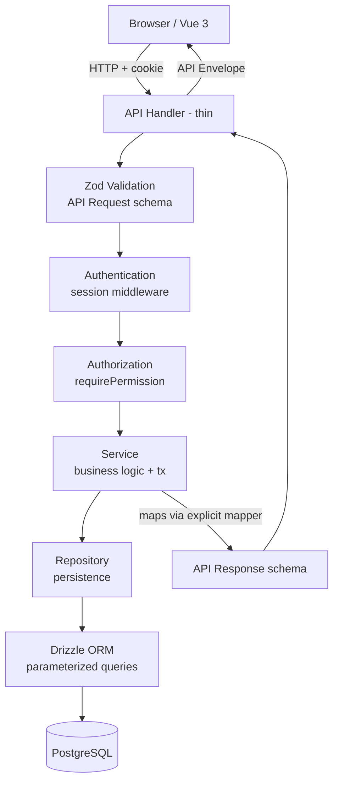
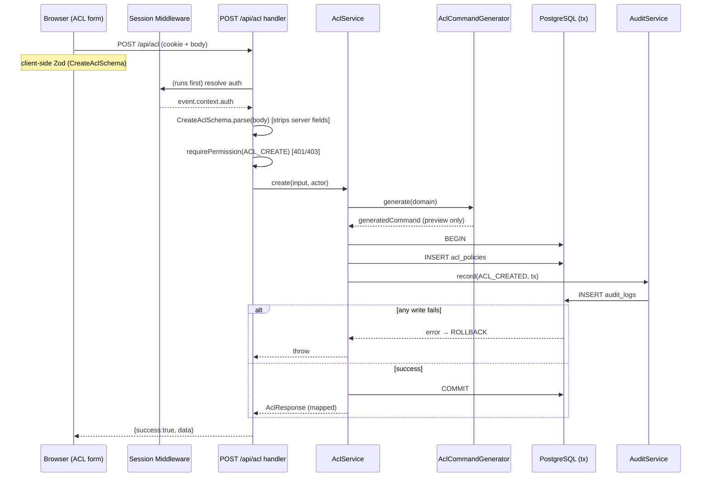

# Design Document

## Overview

NetOps Policy Manager is a single fullstack Nuxt 3 application that lets authenticated, role-scoped operators author and review network ACL and route policies, generate vendor-agnostic device command previews, and audit every significant action. It never pushes configuration to devices and never provisions its own database.

The application is delivered as one Nuxt app running on the Nitro server. Vue 3 renders the frontend; Nitro hosts the `/api` endpoints. All authentication, authorization, validation, business logic, and persistence run on the server. PostgreSQL (accessed through Drizzle ORM) is the only datastore. The whole thing ships as a single multi-stage Docker image.

This design maps directly to the requirements in `requirements.md`; requirement numbers are referenced inline where a design decision satisfies a specific acceptance criterion.

### Design Goals

- **Server-authoritative security** — every auth/authorization/validation check runs server-side, independent of the frontend (Req 2.8, NFR Security 3).
- **Strict model layering** — DB rows never reach the client; Zod schemas are the single source of application types (Req 11).
- **Preview-only command generation** — vendor syntax is isolated behind swappable abstractions and never executed (Req 7).
- **Auditability** — mutations and their audit entries commit atomically in one transaction (Req 8.4, 8.5).
- **Explicit, safe deployment** — no DB provisioning, no auto-migrate, no embedded fallback, validated env at startup (Req 14).

## Architecture

### Request Flow

```
Browser (Vue 3 SPA/SSR)
   │  HTTP + HttpOnly session cookie
   ▼
Nuxt app (Nitro server)
   ├── Vue frontend (pages, components, composables)
   └── Nitro backend (/api handlers → services → repositories)
                                  │
                                  ▼
                            PostgreSQL (via Drizzle)
```

There is exactly one deployable unit. The browser talks only to the Nuxt app; the Nuxt app talks only to PostgreSQL.

### Layering

Every mutating API request passes through the same ordered pipeline. Each layer has one responsibility and hands a narrower, more-typed value to the next.



Ordering note: the session middleware (Authentication) runs globally and populates `event.context.auth` before handlers execute, so in the handler body the effective order is validate input → `requirePermission` → service. Authentication is resolved earlier in the middleware chain (Req 2.5, 2.6).

Responsibilities:

- **API Handler (thin)** — parse request, delegate, wrap the result in the API Envelope. No business logic. (Req 12.1, 12.2)
- **Zod Validation** — parse the request body/query with an explicit API Request schema that excludes Server_Controlled_Fields. (Req 11.4, 13.5)
- **Authentication** — session middleware resolves the current user + permissions from the session cookie, or leaves the context unauthenticated. (Req 1, Req 2.5)
- **Authorization** — `requirePermission(event, perm)` throws 401 if unauthenticated, 403 if the user lacks the permission. (Req 2.6)
- **Service** — business logic; owns transaction boundaries; calls command generators; writes the audit entry in the same transaction as the mutation. (Req 8.4)
- **Repository** — the only layer that knows Drizzle; exposes typed methods returning domain models. (Req 10.7)
- **Drizzle → PostgreSQL** — parameterized queries only. (Req 10.7)

### Model Separation

Five distinct model layers, all derived from Zod schemas via `z.infer` (Req 11.1, 11.2). Explicit mapper functions convert between adjacent layers. **DB rows are never returned to the frontend** (Req 11.3).

| Layer | Origin | Purpose | Crosses to client? |
|-------|--------|---------|--------------------|
| DB model | Drizzle table `$inferSelect` | Exact row shape | No |
| Domain model | Zod domain schema | Business objects used inside services | No |
| API Request model | Zod request schema | Accepted mutation input, excludes Server_Controlled_Fields | Inbound only |
| API Response model | Zod response schema | Safe outbound shape, excludes secrets | Yes |
| UI Form model | Zod form schema (shared) | Frontend form state + client validation | Client-side |

Mapper direction:

```
DB row ──dbToDomain──▶ Domain ──domainToResponse──▶ API Response ──▶ client
client ──▶ API Request ──requestToDomain(+ server fields)──▶ Domain ──domainToDbInsert──▶ DB row
```

Server_Controlled_Fields (`id`, `generatedCommand`, `createdBy`, `createdAt`, `updatedBy`, `updatedAt`) are never present on API Request schemas, so a client cannot set them (Req 4.12, 6.9, 11.4). The server sets them during `requestToDomain` / insert.

## Project Structure

Nuxt 3 convention: application (client + universal) code lives under `app/` (using `srcDir: 'app'`), and server code lives under `server/`. Nuxt auto-imports `server/api/**` as routes based on file name (e.g. `server/api/acl/index.post.ts` → `POST /api/acl`). `shared/` holds code safe for both client and server (Zod schemas, contracts, constants). `database/` holds Drizzle schema, migrations, and seeds and is used by the server and by CLI scripts.

```
netops-policy-manager/
├── app/
│   ├── assets/                      # css (tailwind entry), images
│   ├── components/
│   │   ├── layout/AppSidebar.vue
│   │   ├── layout/AppHeader.vue
│   │   ├── PageHeader.vue
│   │   ├── DataTable.vue
│   │   ├── StatusBadge.vue
│   │   ├── FormField.vue
│   │   ├── ConfirmDialog.vue
│   │   ├── LoadingState.vue
│   │   ├── EmptyState.vue
│   │   ├── ErrorState.vue
│   │   └── Pagination.vue
│   ├── composables/
│   │   ├── useAuth.ts
│   │   ├── usePermissions.ts
│   │   └── useApi.ts                # envelope-aware fetch wrapper
│   ├── layouts/
│   │   ├── auth.vue                 # bare layout for /login
│   │   └── default.vue              # app shell: AppSidebar + AppHeader
│   ├── middleware/
│   │   ├── auth.global.ts           # redirect to /login if unauthenticated
│   │   └── permission.ts            # named route middleware, gates by permission
│   ├── pages/
│   │   ├── login.vue
│   │   ├── index.vue                # dashboard
│   │   ├── acl/
│   │   │   ├── index.vue
│   │   │   └── [id].vue
│   │   ├── routes/
│   │   │   ├── index.vue
│   │   │   └── [id].vue
│   │   ├── administration/
│   │   │   └── users/
│   │   │       ├── index.vue
│   │   │       └── [id].vue
│   │   └── logs/
│   │       ├── index.vue
│   │       └── [id].vue
│   ├── utils/                       # client-only helpers (formatting, etc.)
│   └── app.vue
├── server/
│   ├── api/
│   │   ├── health.get.ts
│   │   ├── auth/
│   │   │   ├── login.post.ts
│   │   │   ├── logout.post.ts
│   │   │   └── me.get.ts
│   │   ├── users/
│   │   │   ├── index.get.ts
│   │   │   ├── index.post.ts
│   │   │   ├── [id].get.ts
│   │   │   ├── [id].patch.ts
│   │   │   ├── [id]/role.patch.ts
│   │   │   ├── [id]/status.patch.ts
│   │   │   └── [id]/reset-password.post.ts
│   │   ├── acl/
│   │   │   ├── index.get.ts
│   │   │   ├── index.post.ts
│   │   │   ├── [id].get.ts
│   │   │   ├── [id].patch.ts
│   │   │   └── [id].delete.ts
│   │   ├── routes/
│   │   │   ├── index.get.ts
│   │   │   ├── index.post.ts
│   │   │   ├── [id].get.ts
│   │   │   ├── [id].patch.ts
│   │   │   └── [id].delete.ts
│   │   ├── audit/
│   │   │   ├── index.get.ts
│   │   │   ├── [id].get.ts
│   │   │   └── export.get.ts
│   │   └── dashboard/
│   │       └── summary.get.ts
│   ├── auth/
│   │   ├── password.ts              # argon2 hash/verify
│   │   ├── session.ts               # token gen, hash, cookie helpers
│   │   └── permissions.ts           # PERMISSIONS, ROLE_PERMISSIONS, hasPermission, requirePermission
│   ├── services/
│   │   ├── auth.service.ts
│   │   ├── user.service.ts
│   │   ├── acl.service.ts
│   │   ├── route.service.ts
│   │   ├── audit.service.ts
│   │   └── dashboard.service.ts
│   ├── repositories/
│   │   ├── user.repository.ts
│   │   ├── session.repository.ts
│   │   ├── acl.repository.ts
│   │   ├── route.repository.ts
│   │   └── audit.repository.ts
│   ├── domain/
│   │   ├── user.ts
│   │   ├── acl.ts
│   │   ├── route.ts
│   │   └── audit.ts                 # domain types (z.infer) + mappers
│   ├── network/                     # future vendor adapter boundary (Req 7.6) — command generators live here
│   │   ├── acl-command-generator.ts
│   │   └── route-command-generator.ts
│   ├── middleware/
│   │   └── 01.session.ts            # global: resolve session → event.context.auth
│   ├── validators/                  # server-side request/query parse helpers
│   ├── utils/
│   │   ├── envelope.ts              # ok()/fail() envelope helpers
│   │   ├── errors.ts                # AppError, error codes, central handler
│   │   └── config.ts               # EnvSchema validation at startup
│   └── plugins/
│       └── validate-env.ts          # runs config validation on Nitro startup (Req 14.2/14.3)
├── shared/
│   ├── schemas/                     # Zod: network primitives, acl, route, user, audit, pagination
│   │   ├── network.ts
│   │   ├── acl.ts
│   │   ├── route.ts
│   │   ├── user.ts
│   │   ├── audit.ts
│   │   └── common.ts                # pagination, envelope types
│   ├── contracts/                   # API request/response contract types
│   ├── types/                       # shared z.infer type exports
│   └── constants/                   # roles, permissions labels, enums
├── database/
│   ├── schema/
│   │   ├── users.ts
│   │   ├── roles.ts
│   │   ├── user-roles.ts
│   │   ├── sessions.ts
│   │   ├── acl-policies.ts
│   │   ├── routes.ts
│   │   ├── audit-logs.ts
│   │   └── index.ts                 # re-export + enums
│   ├── migrations/                  # generated by db:generate
│   ├── seeds/
│   │   └── seed.ts                  # roles + initial admin from env (Req 15.3/15.4)
│   └── index.ts                     # drizzle client factory
├── tests/
│   ├── unit/                        # schemas, generators, rbac, mappers (no DB)
│   └── integration/                 # handlers with mocked repos/services
├── public/
├── Dockerfile
├── .dockerignore
├── .env.example
├── drizzle.config.ts
├── nuxt.config.ts
├── tsconfig.json
├── vitest.config.ts
└── package.json
```

Nuxt convention adjustments:
- `srcDir: 'app'` places pages/components/composables/layouts/middleware under `app/`.
- `server/api/**` filenames encode HTTP method and path; nested folders (e.g. `[id]/role.patch.ts`) create sub-routes.
- `shared/` is auto-importable on both client and server, which is why all Zod schemas live there (single source of types, Req 11.2).
- `server/middleware/01.session.ts` uses a numeric prefix so it runs before route handlers.

## Data Models

### Enums

```typescript
// database/schema/index.ts
import { pgEnum } from 'drizzle-orm/pg-core';

export const userStatusEnum = pgEnum('user_status', ['ACTIVE', 'DISABLED']);
export const aclStatusEnum  = pgEnum('acl_status',  ['DRAFT', 'ACTIVE', 'DISABLED']);
export const routeStatusEnum= pgEnum('route_status',['DRAFT', 'ACTIVE', 'DISABLED']);
export const protocolEnum   = pgEnum('protocol',    ['TCP', 'UDP', 'ICMP', 'ANY']);   // Req 4.4
export const actionEnum     = pgEnum('acl_action',  ['ALLOW', 'DENY']);               // Req 4.7
export const auditResultEnum= pgEnum('audit_result',['SUCCESS', 'FAILURE']);
```

### Drizzle Schema

Requirement mapping: UUID primary keys (Req 10.2), unique username (Req 10.3), FKs (Req 10.4), no duplicate role assignments (Req 10.5), indexes (Req 10.6).

```typescript
// database/schema/users.ts
import { pgTable, uuid, varchar, timestamp, index } from 'drizzle-orm/pg-core';
import { userStatusEnum } from './index';

export const users = pgTable('users', {
  id: uuid('id').primaryKey().defaultRandom(),
  username: varchar('username', { length: 64 }).notNull().unique(),        // Req 10.3
  displayName: varchar('display_name', { length: 128 }).notNull(),
  passwordHash: varchar('password_hash', { length: 255 }).notNull(),       // Argon2 (NFR Sec 1)
  status: userStatusEnum('status').notNull().default('ACTIVE'),
  createdAt: timestamp('created_at', { withTimezone: true }).notNull().defaultNow(),
  updatedAt: timestamp('updated_at', { withTimezone: true }).notNull().defaultNow(),
}, (t) => ({
  usernameIdx: index('users_username_idx').on(t.username),                 // Req 10.6
}));
```

```typescript
// database/schema/roles.ts
export const roles = pgTable('roles', {
  id: uuid('id').primaryKey().defaultRandom(),
  code: varchar('code', { length: 16 }).notNull().unique(),                // ADMIN | L2 | NOC
  name: varchar('name', { length: 64 }).notNull(),
  description: varchar('description', { length: 255 }),
  createdAt: timestamp('created_at', { withTimezone: true }).notNull().defaultNow(),
  updatedAt: timestamp('updated_at', { withTimezone: true }).notNull().defaultNow(),
});
```

```typescript
// database/schema/user-roles.ts
import { pgTable, uuid, primaryKey } from 'drizzle-orm/pg-core';
import { users } from './users';
import { roles } from './roles';

export const userRoles = pgTable('user_roles', {
  userId: uuid('user_id').notNull().references(() => users.id, { onDelete: 'cascade' }), // Req 10.4
  roleId: uuid('role_id').notNull().references(() => roles.id, { onDelete: 'restrict' }),
}, (t) => ({
  pk: primaryKey({ columns: [t.userId, t.roleId] }),   // composite PK prevents duplicate assignment (Req 10.5)
}));
```

```typescript
// database/schema/sessions.ts
import { pgTable, uuid, varchar, timestamp, index } from 'drizzle-orm/pg-core';
import { users } from './users';

export const sessions = pgTable('sessions', {
  id: uuid('id').primaryKey().defaultRandom(),
  userId: uuid('user_id').notNull().references(() => users.id, { onDelete: 'cascade' }),
  tokenHash: varchar('token_hash', { length: 255 }).notNull().unique(),    // only the hash (Req 1.4, NFR Sec 2)
  expiresAt: timestamp('expires_at', { withTimezone: true }).notNull(),    // Req 1.5
  createdAt: timestamp('created_at', { withTimezone: true }).notNull().defaultNow(),
  lastUsedAt: timestamp('last_used_at', { withTimezone: true }).notNull().defaultNow(), // Req 1.5, 1.6
  sourceIp: varchar('source_ip', { length: 64 }),
  userAgent: varchar('user_agent', { length: 512 }),
}, (t) => ({
  tokenHashIdx: index('sessions_token_hash_idx').on(t.tokenHash),
  userExpiresIdx: index('sessions_user_expires_idx').on(t.userId, t.expiresAt),
}));
```

```typescript
// database/schema/acl-policies.ts
import { pgTable, uuid, varchar, integer, timestamp, index } from 'drizzle-orm/pg-core';
import { users } from './users';
import { aclStatusEnum, protocolEnum, actionEnum } from './index';

export const aclPolicies = pgTable('acl_policies', {
  id: uuid('id').primaryKey().defaultRandom(),
  name: varchar('name', { length: 128 }).notNull(),
  source: varchar('source', { length: 64 }).notNull(),
  destination: varchar('destination', { length: 64 }).notNull(),
  protocol: protocolEnum('protocol').notNull(),
  port: integer('port'),                                    // null for ICMP/ANY (Req 4.6)
  action: actionEnum('action').notNull(),
  timeStart: varchar('time_start', { length: 8 }),
  timeEnd: varchar('time_end', { length: 8 }),
  changeTicket: varchar('change_ticket', { length: 64 }),
  description: varchar('description', { length: 1000 }),
  status: aclStatusEnum('status').notNull().default('DRAFT'),
  generatedCommand: varchar('generated_command', { length: 2000 }).notNull(), // server-set (Req 4.11)
  createdBy: uuid('created_by').notNull().references(() => users.id),           // Req 10.4
  updatedBy: uuid('updated_by').notNull().references(() => users.id),
  createdAt: timestamp('created_at', { withTimezone: true }).notNull().defaultNow(),
  updatedAt: timestamp('updated_at', { withTimezone: true }).notNull().defaultNow(),
}, (t) => ({
  nameIdx: index('acl_name_idx').on(t.name),                 // Req 10.6
  statusIdx: index('acl_status_idx').on(t.status),
  changeTicketIdx: index('acl_change_ticket_idx').on(t.changeTicket),
}));
```

```typescript
// database/schema/routes.ts
import { pgTable, uuid, varchar, timestamp, index } from 'drizzle-orm/pg-core';
import { users } from './users';
import { routeStatusEnum } from './index';

export const routes = pgTable('routes', {
  id: uuid('id').primaryKey().defaultRandom(),
  name: varchar('name', { length: 128 }).notNull(),
  destination: varchar('destination', { length: 64 }).notNull(),   // CIDR (Req 6.4)
  source: varchar('source', { length: 64 }),
  nextHop: varchar('next_hop', { length: 64 }).notNull(),          // IP (Req 6.5)
  policy: varchar('policy', { length: 128 }),
  timeStart: varchar('time_start', { length: 8 }),
  timeEnd: varchar('time_end', { length: 8 }),
  changeTicket: varchar('change_ticket', { length: 64 }),
  status: routeStatusEnum('status').notNull().default('DRAFT'),
  generatedCommand: varchar('generated_command', { length: 2000 }).notNull(), // server-set (Req 6.8)
  createdBy: uuid('created_by').notNull().references(() => users.id),
  updatedBy: uuid('updated_by').notNull().references(() => users.id),
  createdAt: timestamp('created_at', { withTimezone: true }).notNull().defaultNow(),
  updatedAt: timestamp('updated_at', { withTimezone: true }).notNull().defaultNow(),
}, (t) => ({
  destinationIdx: index('routes_destination_idx').on(t.destination),  // Req 10.6
  statusIdx: index('routes_status_idx').on(t.status),
}));
```

```typescript
// database/schema/audit-logs.ts
import { pgTable, uuid, varchar, timestamp, jsonb, index } from 'drizzle-orm/pg-core';
import { auditResultEnum } from './index';

export const auditLogs = pgTable('audit_logs', {
  id: uuid('id').primaryKey().defaultRandom(),
  timestamp: timestamp('timestamp', { withTimezone: true }).notNull().defaultNow(),
  actorUserId: uuid('actor_user_id'),          // nullable: LOGIN_FAILED may have no known user
  actorUsername: varchar('actor_username', { length: 64 }),
  actorRole: varchar('actor_role', { length: 16 }),
  activity: varchar('activity', { length: 64 }).notNull(),   // LOGIN_SUCCESS ... ROUTE_DELETED (Req 8.1)
  entityType: varchar('entity_type', { length: 32 }),        // USER | ACL | ROUTE | SESSION
  entityId: uuid('entity_id'),
  result: auditResultEnum('result').notNull(),
  sourceIp: varchar('source_ip', { length: 64 }),
  changeTicket: varchar('change_ticket', { length: 64 }),
  beforeState: jsonb('before_state'),   // JSONB (Req 8.2)
  afterState: jsonb('after_state'),     // JSONB (Req 8.2)
  metadata: jsonb('metadata'),          // JSONB (Req 8.2)
}, (t) => ({
  timestampIdx: index('audit_timestamp_idx').on(t.timestamp),        // Req 10.6
  actorIdx: index('audit_actor_idx').on(t.actorUserId),
  activityIdx: index('audit_activity_idx').on(t.activity),
}));
```

There is **no** endpoint or repository method that deletes audit rows during normal operation (Req 8.6).

### Zod Application Schemas

All schemas live under `shared/schemas/` and are the source of application types via `z.infer` (Req 11.2). Empty strings are rejected for required fields (Req 5.9), and description fields are length-capped (Req 5.10).

#### Network primitives (`shared/schemas/network.ts`) — Req 5.1

```typescript
import { z } from 'zod';

// IPv4 accepted; other forms rejected (Req 5.2)
export const Ipv4Schema = z.string().ip({ version: 'v4' });

// IPv4 or IPv6 (Req 5.4)
export const IpAddressSchema = z.string().ip();

// ip/prefix, prefix 0..32 for v4 (Req 5.3)
export const CidrSchema = z.string().refine(isValidCidr, { message: 'Invalid CIDR notation' });

// integer 1..65535 (Req 5.5)
export const PortSchema = z.number().int().min(1).max(65535);

export const ProtocolSchema = z.enum(['TCP', 'UDP', 'ICMP', 'ANY']);  // Req 5.6

// HH:MM 24h (Req 5.7)
export const TimeSchema = z.string().regex(/^([01]\d|2[0-3]):[0-5]\d$/, 'Invalid time');

// e.g. CHG-123456 (Req 5.8)
export const ChangeTicketSchema = z.string().min(1).regex(/^[A-Z]+-\d+$/, 'Invalid change ticket');

const DescriptionSchema = z.string().max(1000);  // Req 5.10
```

#### ACL schemas (`shared/schemas/acl.ts`) — Req 4

```typescript
const AclBase = z.object({
  name: z.string().min(1).max(128),
  source: z.string().min(1),          // Ipv4 / Cidr / 'any' per field policy
  destination: z.string().min(1),
  protocol: ProtocolSchema,
  port: PortSchema.optional(),
  action: z.enum(['ALLOW', 'DENY']),  // Req 4.7
  timeStart: TimeSchema.optional(),
  timeEnd: TimeSchema.optional(),
  changeTicket: ChangeTicketSchema.optional(),
  description: DescriptionSchema.optional(),
  status: z.enum(['DRAFT', 'ACTIVE', 'DISABLED']),  // Req 4.8
});

// Cross-field refinements (Req 4.5, 4.6)
const withPortRules = <T extends typeof AclBase>(s: T) => s.superRefine((v, ctx) => {
  if ((v.protocol === 'TCP' || v.protocol === 'UDP') && v.port === undefined) {
    ctx.addIssue({ code: 'custom', path: ['port'], message: 'Port required for TCP/UDP' }); // Req 4.5
  }
  if (v.protocol === 'ICMP' && v.port !== undefined) {
    ctx.addIssue({ code: 'custom', path: ['port'], message: 'ICMP must not have a port' }); // Req 4.6
  }
});

export const CreateAclSchema = withPortRules(AclBase);           // excludes Server_Controlled_Fields (Req 4.12)
export const UpdateAclSchema = withPortRules(AclBase.partial().required({ status: true }));
export const AclResponseSchema = AclBase.extend({
  id: z.string().uuid(),
  generatedCommand: z.string(),
  createdBy: z.string().uuid(),
  updatedBy: z.string().uuid(),
  createdAt: z.string(),
  updatedAt: z.string(),
});
```

#### Route schemas (`shared/schemas/route.ts`) — Req 6

```typescript
const RouteBase = z.object({
  name: z.string().min(1).max(128),
  destination: CidrSchema,            // Req 6.4
  source: z.string().min(1).optional(),
  nextHop: IpAddressSchema,           // Req 6.5
  policy: z.string().max(128).optional(),
  timeStart: TimeSchema.optional(),
  timeEnd: TimeSchema.optional(),
  changeTicket: ChangeTicketSchema.optional(),
  status: z.enum(['DRAFT', 'ACTIVE', 'DISABLED']),
});

export const CreateRouteSchema = RouteBase;                     // Req 6.9 (no server fields)
export const UpdateRouteSchema = RouteBase.partial().required({ status: true });
export const RouteResponseSchema = RouteBase.extend({
  id: z.string().uuid(),
  generatedCommand: z.string(),
  createdBy: z.string().uuid(),
  updatedBy: z.string().uuid(),
  createdAt: z.string(),
  updatedAt: z.string(),
});
```

#### User schemas (`shared/schemas/user.ts`) — Req 3

```typescript
export const CreateUserSchema = z.object({
  username: z.string().min(1).max(64),
  displayName: z.string().min(1).max(128),
  password: z.string().min(12),        // hashed server-side; never stored raw
  roleCode: z.enum(['ADMIN', 'L2', 'NOC']),
});
export const UpdateUserSchema = z.object({ displayName: z.string().min(1).max(128) });
export const ChangeUserRoleSchema = z.object({ roleCode: z.enum(['ADMIN', 'L2', 'NOC']) });   // Req 3.4
export const ResetPasswordSchema = z.object({ password: z.string().min(12) });                // Req 3.6

// Never exposes password, passwordHash, or token (Req 3.7, NFR Sec 5)
export const UserResponseSchema = z.object({
  id: z.string().uuid(),
  username: z.string(),
  displayName: z.string(),
  status: z.enum(['ACTIVE', 'DISABLED']),
  roles: z.array(z.enum(['ADMIN', 'L2', 'NOC'])),
  createdAt: z.string(),
  updatedAt: z.string(),
});
```

#### Audit, pagination, env (`shared/schemas/audit.ts`, `shared/schemas/common.ts`, `server/utils/config.ts`)

```typescript
// Pagination query (Req 12.6) — clamps limit to a max, offset >= 0
export const PaginationQuerySchema = z.object({
  page: z.coerce.number().int().min(1).default(1),
  limit: z.coerce.number().int().min(1).max(100).default(20),
  search: z.string().optional(),
});

export const AuditQuerySchema = PaginationQuerySchema.extend({
  activity: z.string().optional(),
  result: z.enum(['SUCCESS', 'FAILURE']).optional(),
  from: z.string().optional(),        // date filter (Req 8.7)
  to: z.string().optional(),
});

export const AuditResponseSchema = z.object({
  id: z.string().uuid(),
  timestamp: z.string(),
  actorUsername: z.string().nullable(),
  actorRole: z.string().nullable(),
  activity: z.string(),
  entityType: z.string().nullable(),
  entityId: z.string().nullable(),
  result: z.enum(['SUCCESS', 'FAILURE']),
  sourceIp: z.string().nullable(),
  changeTicket: z.string().nullable(),
  beforeState: z.unknown().nullable(),
  afterState: z.unknown().nullable(),
  metadata: z.unknown().nullable(),
});

// Startup env validation (Req 14.1, 14.2, 14.3)
export const EnvSchema = z.object({
  NODE_ENV: z.enum(['development', 'production', 'test']).default('development'),
  DATABASE_URL: z.string().url(),
  SESSION_SECRET: z.string().min(32),
});
```

## Components and Interfaces

### Authentication (`server/auth/`)

- **Token generation** — `randomBytes(32)` from Node `crypto`, base64url-encoded → raw Session_Token (high entropy).
- **Hashing** — `argon2.hash(password)` for user passwords (NFR Sec 1); `sha256(token)` for the session token hash stored in `sessions.token_hash` (Req 1.4, NFR Sec 2). The raw token lives only in the HttpOnly cookie.
- **`password.ts`** — `hashPassword(raw)`, `verifyPassword(hash, raw)` using Argon2 (Req 1.1).
- **`session.ts`** — `generateToken()`, `hashToken(raw)`, `setSessionCookie(event, raw)`, `clearSessionCookie(event)`.
- **Session repository** — `create({userId, tokenHash, expiresAt, sourceIp, userAgent})`, `findByTokenHash(hash)`, `touch(id)` (updates `lastUsedAt`, Req 1.6), `deleteByTokenHash(hash)` (logout, Req 1.8).
- **Session middleware** (`server/middleware/01.session.ts`) — reads the cookie, hashes it, looks up the session, checks expiry (expired → context stays unauthenticated so `requirePermission` yields 401, Req 1.7), resolves the user + roles + permissions, updates `lastUsedAt`, and sets `event.context.auth = { user, permissions }`.
- **Handlers** — `login.post.ts` (verify, issue, LOGIN_SUCCESS / LOGIN_FAILED audit — Req 1.10, 1.11), `logout.post.ts` (invalidate — Req 1.8, LOGOUT audit), `me.get.ts` (return identity + permissions in envelope — Req 1.9).

Cookie flags: `HttpOnly`, `SameSite=Lax`, `Path=/`; `Secure` added only when `NODE_ENV==='production'` (Req 1.2, 1.3).

### RBAC (`server/auth/permissions.ts`) — Req 2

```typescript
export const PERMISSIONS = {
  USER_READ:'USER_READ', USER_MANAGE:'USER_MANAGE',
  ACL_READ:'ACL_READ', ACL_CREATE:'ACL_CREATE', ACL_UPDATE:'ACL_UPDATE', ACL_DELETE:'ACL_DELETE',
  ROUTE_READ:'ROUTE_READ', ROUTE_CREATE:'ROUTE_CREATE', ROUTE_UPDATE:'ROUTE_UPDATE', ROUTE_DELETE:'ROUTE_DELETE',
  AUDIT_READ:'AUDIT_READ', AUDIT_EXPORT:'AUDIT_EXPORT',
} as const;                                                    // Req 2.2
export type Permission = typeof PERMISSIONS[keyof typeof PERMISSIONS];
export type Role = 'ADMIN' | 'L2' | 'NOC';                     // Req 2.1

// Single centralized mapping (Req 2.3)
export const ROLE_PERMISSIONS: Record<Role, Permission[]> = {
  ADMIN: Object.values(PERMISSIONS),
  L2:    [PERMISSIONS.ACL_READ, PERMISSIONS.ACL_CREATE, PERMISSIONS.ACL_UPDATE, PERMISSIONS.ACL_DELETE,
          PERMISSIONS.ROUTE_READ, PERMISSIONS.ROUTE_CREATE, PERMISSIONS.ROUTE_UPDATE, PERMISSIONS.ROUTE_DELETE,
          PERMISSIONS.AUDIT_READ],
  NOC:   [PERMISSIONS.ACL_READ, PERMISSIONS.ROUTE_READ, PERMISSIONS.AUDIT_READ],
};

export function hasPermission(user: AuthUser, perm: Permission): boolean {  // Req 2.4
  return user.roles.some((r) => ROLE_PERMISSIONS[r]?.includes(perm));
}

export function requirePermission(event, perm: Permission): AuthUser {      // Req 2.4
  const auth = event.context.auth;
  if (!auth?.user) throw new AppError('UNAUTHENTICATED', 401);              // Req 2.5
  if (!hasPermission(auth.user, perm)) throw new AppError('FORBIDDEN', 403); // Req 2.6
  return auth.user;
}
```

Every protected handler calls `requirePermission` first; the server enforces this independently of the frontend (Req 2.8).

### Services (`server/services/`)

Each mutating service method opens one Drizzle transaction and writes both the mutation and its audit entry inside it. If the audit write throws, the transaction rolls back the mutation (Req 8.4, 8.5).

- **AuthService** — `login(username, password, ctx)` → verify (Req 1.1), create session, write LOGIN_SUCCESS/LOGIN_FAILED; `logout(tokenHash, ctx)`; `me(user)`.
- **UserService** — `list(query)`, `create(input, actor)` (+USER_CREATED, Req 3.8), `updateBasic(id, input, actor)` (+USER_UPDATED, Req 3.9), `changeRole(id, input, actor)` (+USER_ROLE_CHANGED, Req 3.4), `setStatus(id, active, actor)` (+USER_STATUS_CHANGED, Req 3.5), `resetPassword(id, input, actor)` (Argon2 hash, Req 3.6). All reads mapped through `UserResponseSchema` (Req 3.7). *Transaction boundary:* one tx per mutation wrapping the row change + audit insert.
- **AclService** — `list`, `getById`, `create(input, actor)`, `update(id, input, actor)`, `remove(id, actor)`. On create/update it calls `AclCommandGenerator.generate(domain)` and stores the result in `generatedCommand` (Req 4.11). *Transaction boundary:* mutation + ACL_CREATED/UPDATED/DELETED audit in one tx (Req 4.13–4.15).
- **RouteService** — mirror of AclService using `RouteCommandGenerator` (Req 6.8) and ROUTE_* audit entries in one tx (Req 6.10–6.12).
- **AuditService** — `record(entry, tx)` (transaction-aware; called by other services with the current tx handle — Req 8.4), `list(query)` (Req 8.7), `getById(id)` (Req 8.8), `export(query)` (Req 8.9). Strips secrets from `before/after/metadata` before writing (Req 8.3, NFR Sec 5). No delete method (Req 8.6).
- **DashboardService** — `summary()` returns `{ aclTotal, aclActive, routeTotal, routeActive, recentActivities }` via count queries (Req 9.1–9.6). No chart rendering (Req 9.6, NFR Perf 3).

### Command Generators (`server/network/`) — Req 7

```typescript
export interface AclCommandGenerator {
  generate(acl: AclDomain): string;    // preview only; never executes (Req 7.3)
}
export interface RouteCommandGenerator {
  generate(route: RouteDomain): string;
}
```

A default generic/Cisco-like implementation (`DefaultAclCommandGenerator`, `DefaultRouteCommandGenerator`) produces preview strings such as `access-list <name> <action> <protocol> <source> <destination> [eq <port>]`. Generators are pure functions of the domain model and run only on the server (Req 7.1, 7.2). The domain model carries no vendor syntax (Req 7.5). `server/network/` is the boundary where future vendor adapters swap in behind these interfaces without touching the domain model (Req 7.4, 7.6); no simulated device connections are added.

### API Endpoints — Req 12, Req 16

| Method | Path | Permission | Request schema | Response |
|--------|------|-----------|----------------|----------|
| POST | `/api/auth/login` | none | `{username,password}` | `{user, permissions}` |
| POST | `/api/auth/logout` | valid session | — | `{}` |
| GET | `/api/auth/me` | valid session | — | `{user, permissions}` (Req 1.9) |
| GET | `/api/health` | none | — | `{status:"healthy"}` (Req 16.4) |
| GET | `/api/users` | USER_READ | `PaginationQuerySchema` | `Paginated<UserResponse>` (Req 3.1) |
| POST | `/api/users` | USER_MANAGE | `CreateUserSchema` | `UserResponse` (Req 3.2) |
| GET | `/api/users/:id` | USER_READ | — | `UserResponse` |
| PATCH | `/api/users/:id` | USER_MANAGE | `UpdateUserSchema` | `UserResponse` (Req 3.3) |
| PATCH | `/api/users/:id/role` | USER_MANAGE | `ChangeUserRoleSchema` | `UserResponse` (Req 3.4) |
| PATCH | `/api/users/:id/status` | USER_MANAGE | `{status}` | `UserResponse` (Req 3.5) |
| POST | `/api/users/:id/reset-password` | USER_MANAGE | `ResetPasswordSchema` | `{}` (Req 3.6) |
| GET | `/api/acl` | ACL_READ | `PaginationQuerySchema` + filters | `Paginated<AclResponse>` (Req 4.1) |
| POST | `/api/acl` | ACL_CREATE | `CreateAclSchema` | `AclResponse` (Req 4.3) |
| GET | `/api/acl/:id` | ACL_READ | — | `AclResponse` (Req 4.2) |
| PATCH | `/api/acl/:id` | ACL_UPDATE | `UpdateAclSchema` | `AclResponse` (Req 4.9) |
| DELETE | `/api/acl/:id` | ACL_DELETE | — | `{}` (Req 4.10) |
| GET | `/api/routes` | ROUTE_READ | `PaginationQuerySchema` + filters | `Paginated<RouteResponse>` (Req 6.1) |
| POST | `/api/routes` | ROUTE_CREATE | `CreateRouteSchema` | `RouteResponse` (Req 6.3) |
| GET | `/api/routes/:id` | ROUTE_READ | — | `RouteResponse` (Req 6.2) |
| PATCH | `/api/routes/:id` | ROUTE_UPDATE | `UpdateRouteSchema` | `RouteResponse` (Req 6.6) |
| DELETE | `/api/routes/:id` | ROUTE_DELETE | — | `{}` (Req 6.7) |
| GET | `/api/audit` | AUDIT_READ | `AuditQuerySchema` | `Paginated<AuditResponse>` (Req 8.7) |
| GET | `/api/audit/:id` | AUDIT_READ | — | `AuditResponse` (Req 8.8) |
| GET | `/api/audit/export` | AUDIT_EXPORT | `AuditQuerySchema` | export payload (Req 8.9) |
| GET | `/api/dashboard/summary` | valid session | — | summary object (Req 9) |

All list endpoints paginate server-side (Req 12.6, NFR Perf 1).

### Frontend Components — Req 13, Req 2.7

- **Layouts**: `auth.vue` (bare, for `/login`) and `default.vue` (app shell with `AppSidebar` + `AppHeader`). Sidebar links are permission-gated (Req 2.7).
- **Pages**: `login`, `index` (dashboard), `acl/`, `routes/`, `administration/users/`, `logs/`.
- **Reusable components**: `PageHeader`, `DataTable`, `StatusBadge`, `FormField`, `ConfirmDialog` (destructive-action confirm — Req 13.3), `LoadingState`, `EmptyState`, `ErrorState` (every data page provides these — Req 13.1, 13.2), `Pagination`.
- **Composables**:
  - `useAuth()` — current user, login/logout, calls `/api/auth/me`.
  - `usePermissions()` — `can(perm)` helper used to hide gated menus/buttons (Req 2.7).
  - `useApi()` — fetch wrapper that unwraps the API Envelope, throwing a typed error on `{success:false}` and returning `data` on success.
- **Route middleware**: `auth.global.ts` redirects unauthenticated users to `/login`; `permission.ts` (named) gates pages by required permission. These are UX conveniences only — the server re-enforces everything (Req 2.8, 13.5).
- Forms validate with the shared Zod schemas (Req 13.4) and provide labels, semantic buttons, readable errors, and keyboard navigation (Req 13.6, NFR Accessibility).

### Theming and Visual Consistency (`app/assets/css/tailwind.css`) — Req 13.7–13.11

The application is **light-theme only** — there is no dark mode and no theme toggle (Req 13.7). The NetOps design tokens (surface, panel, line, ink, muted, brand, sidebar, ok/bad, terminal) are declared once under Tailwind's `@theme` and are the single source of color truth; components never hard-code hex values.

Nuxt UI v4 derives every component and overlay from its own `--ui-*` semantic variables (`--ui-bg`, `--ui-text`, `--ui-border`, the `neutral` palette, …) and ships a full dark theme that activates on a `.dark` ancestor class. A stray `.dark` (SSR flash, a stale `@nuxtjs/color-mode` value in `localStorage`, or the OS preference) is what caused dark surfaces to leak into overlays such as the Administration and Profile modals. Locking the color mode to `light` in `nuxt.config` plus a client plugin reduces but does not eliminate this, because teleported overlays and native browser chrome can still resolve a dark scheme. The design therefore neutralizes dark mode in one place — the global stylesheet — rather than patching individual components:

- **Semantic token mapping (Req 13.8, 13.9).** `tailwind.css` maps the Nuxt UI `--ui-*` variables to the NetOps light tokens (`--ui-bg → panel`, `--ui-text → ink`, `--ui-border/muted → line`, `--ui-primary → brand`, etc.) and repeats the same values under `:root`, `.light`, **and** `.dark`. This makes every Nuxt UI surface, text color, and border render in the light palette no matter which color-mode class wins.
- **Forced UA color-scheme (Req 13.10).** `:root { color-scheme: light }` keeps native chrome (form controls, and notably scrollbars) light even if Nuxt UI applies `scheme-dark` from a stray `.dark`.
- **Explicit scrollbar styling (Req 13.10).** Because `color-scheme: light` alone is insufficient on Chromium/Windows when the OS theme is dark (overflow areas — e.g. the Profile modal's MFA device list — still paint a dark native scrollbar), the stylesheet styles scrollbars directly: `scrollbar-color`/`scrollbar-width` for Firefox and `::-webkit-scrollbar*` rules for Chromium/WebKit, using `surface`/`line`/`muted` tokens.
- **No per-component dark patches (Req 13.11).** Components and pages must not carry per-instance `:ui` overrides (e.g. `content: 'bg-white …'`) to force a light look; the global mapping owns this. Earlier band-aid overrides on the Change Role and Profile modals were removed once the global fix was in place, keeping shared components (`FormField`, `ConfirmDialog`, modals) styled uniformly.

This lives entirely in the one Tailwind entry stylesheet so the light theme is deterministic and defined once (Req 13.11).

### API Envelope & Error Handling (`server/utils/envelope.ts`, `server/utils/errors.ts`)

```typescript
export const ok = <T>(data: T) => ({ success: true, data } as const);        // Req 12.1
export const fail = (code: ErrorCode, message: string, fields?: Record<string,string>) =>
  ({ success: false, error: { code, message, ...(fields ? { fields } : {}) } } as const); // Req 12.2

export type ErrorCode =
  | 'VALIDATION_ERROR' | 'UNAUTHENTICATED' | 'FORBIDDEN'
  | 'NOT_FOUND' | 'CONFLICT' | 'INTERNAL_ERROR';
```

A central error handler (Nitro `error` hook + per-handler `try/catch` wrapper) maps:
- `ZodError` → `VALIDATION_ERROR` (400) with `fields` built from `issue.path` → `issue.message` (Req 12.3).
- `AppError('UNAUTHENTICATED')` → 401, `AppError('FORBIDDEN')` → 403, `NOT_FOUND` → 404, `CONFLICT` → 409.
- Any other error → `INTERNAL_ERROR` (500) with a generic message; SQL text, stack traces, filesystem paths, and secrets are excluded from the response and logged server-side only (Req 12.4, 12.5).

## Data Flow — Add ACL (representative mutation)

Sequence for `POST /api/acl` (Req 4.3, 4.11, 4.13):

1. The ACL form validates input client-side with the shared `CreateAclSchema` (Req 13.4).
2. `useApi()` sends `POST /api/acl` with the session cookie.
3. The global session middleware resolves `event.context.auth` (Req 1, 2.5).
4. The handler parses the body with `CreateAclSchema` — Server_Controlled_Fields are absent from the schema, so any client-supplied `id`/`generatedCommand`/`createdBy`/etc. are ignored (Req 4.12, 11.4); invalid input → `VALIDATION_ERROR` with `fields`.
5. The handler calls `requirePermission(event, 'ACL_CREATE')` → 401/403 if it fails (Req 2.5, 2.6).
6. `AclService.create(input, actor)` opens one transaction: it builds the domain object, calls `AclCommandGenerator.generate()` to produce `generatedCommand` (Req 4.11), inserts the ACL row, and inserts an `ACL_CREATED` audit entry in the same transaction (Req 4.13, 8.4). If either write fails, the transaction rolls back (Req 8.5).
7. The service maps the new row to the API Response via `AclResponseSchema` (never a raw DB row — Req 11.3).
8. The handler wraps it as `{success:true, data}` (Req 12.1); the client unwraps it and updates the list.



## Error Handling

| Code | HTTP | When |
|------|------|------|
| `VALIDATION_ERROR` | 400 | Zod parse failure; `fields` populated from issue paths (Req 12.3) |
| `UNAUTHENTICATED` | 401 | No/expired session on a protected endpoint (Req 2.5, 1.7) |
| `FORBIDDEN` | 403 | Valid session, missing permission (Req 2.6) |
| `NOT_FOUND` | 404 | Entity id not found |
| `CONFLICT` | 409 | Unique constraint (e.g. duplicate username) |
| `INTERNAL_ERROR` | 500 | Unexpected error; generic message only (Req 12.4) |

Internal errors never leak SQL, stack traces, filesystem paths, or secrets to the client; full detail is logged server-side only (Req 12.4, 12.5, NFR Sec 5).

## Correctness Properties

*A property is a characteristic or behavior that should hold true across all valid executions of a system — a formal statement about what the system should do. Properties bridge human-readable specifications and machine-verifiable correctness guarantees.*

### Property 1: IPv4 validation soundness

*For any* string, `Ipv4Schema` accepts it if and only if it is a syntactically valid IPv4 address (four dot-separated octets each in 0–255).

**Validates: Requirements 5.2**

### Property 2: CIDR validation soundness

*For any* string, `CidrSchema` accepts it if and only if it is a valid IP address followed by a prefix length within the allowed range.

**Validates: Requirements 5.3, 6.4**

### Property 3: Port range invariant

*For any* number, `PortSchema` accepts it if and only if it is an integer within 1..65535 inclusive.

**Validates: Requirements 5.5**

### Property 4: Protocol membership

*For any* string, `ProtocolSchema` accepts it if and only if it is one of `TCP`, `UDP`, `ICMP`, or `ANY`.

**Validates: Requirements 5.6, 4.4**

### Property 5: ACL protocol/port cross-field rule

*For any* ACL input, it validates if and only if either the protocol is `TCP` or `UDP` with a port in 1..65535, or the protocol is `ICMP` or `ANY` with no port supplied.

**Validates: Requirements 4.5, 4.6**

### Property 6: Next hop must be a valid IP

*For any* route input, validation succeeds only when `nextHop` is a syntactically valid IP address, and fails for any invalid next hop.

**Validates: Requirements 6.5**

### Property 7: Time validation soundness

*For any* string, `TimeSchema` accepts it if and only if it is a well-formed 24-hour `HH:MM` value.

**Validates: Requirements 5.7**

### Property 8: Required fields reject empty strings

*For any* required-string schema in the Validation_Layer, an empty string is rejected.

**Validates: Requirements 5.9**

### Property 9: Response mappers never expose secrets

*For any* user domain object (including its password hash and any session token), the object produced by the user response mapper contains no `password`, `passwordHash`, or token field.

**Validates: Requirements 3.7, 11.3, NFR Security 5**

### Property 10: Request schemas strip Server_Controlled_Fields

*For any* mutation payload that also includes Server_Controlled_Fields (`id`, `generatedCommand`, `createdBy`, `createdAt`, `updatedBy`, `updatedAt`), the parsed API Request value does not carry those client-supplied fields.

**Validates: Requirements 4.12, 6.9, 11.4**

### Property 11: Command generation is a deterministic preview

*For any* valid ACL or route domain object, the corresponding command generator returns a non-empty preview string and produces the same output on repeated calls for the same input, without executing anything against a device.

**Validates: Requirements 4.11, 6.8, 7.3**

### Property 12: hasPermission agrees with the centralized map

*For any* user with a set of roles and any permission, `hasPermission(user, permission)` returns true if and only if some role held by the user grants that permission in `ROLE_PERMISSIONS`.

**Validates: Requirements 2.3, 2.4**

### Property 13: Zod errors map to fields

*For any* Zod validation error, the produced envelope error has `code = VALIDATION_ERROR` and a `fields` entry for every offending field path.

**Validates: Requirements 12.2, 12.3**

### Property 14: Internal errors never leak sensitive detail

*For any* internal error (including ones whose message contains SQL text, stack traces, filesystem paths, or secrets), the client-facing error is `INTERNAL_ERROR` with a generic message and none of that sensitive substring content.

**Validates: Requirements 12.4**

### Property 15: Pagination bounds response size

*For any* requested pagination parameters, the effective limit parsed by `PaginationQuerySchema` is within 1..MAX and the page is at least 1.

**Validates: Requirements 12.6, NFR Performance 1**

## Testing Strategy

Testing uses Vitest with a dual approach: **property-based tests** for universal input-varying behavior and **example/integration tests** for specific scenarios and wiring. Property tests run a minimum of 100 iterations and are tagged `Feature: netops-policy-manager, Property {n}: {text}`.

### Unit tests (no DB)

- **Network schemas** — Properties 1–8 (IPv4, CIDR, port, protocol, ACL cross-field, next hop, time, empty-string rejection).
- **Command generators** — Property 11 (non-empty, deterministic preview).
- **RBAC helpers** — Property 12 (`hasPermission` vs `ROLE_PERMISSIONS`).
- **Mappers** — Properties 9 and 10 (response mappers strip secrets; request schemas strip server fields).
- **Error handler** — Properties 13 and 14 (Zod→fields, internal-error redaction).
- **Pagination** — Property 15.

### Integration-style tests (handlers with mocked repositories/services)

- Auth 401 (unauthenticated) and 403 (missing permission) on protected endpoints.
- Server-controlled field rejection at the handler boundary.
- `passwordHash` absent from user API responses.
- Audit-on-create for ACL and route (audit insert invoked within the mutation transaction; audit failure rolls back the mutation).

### Required test cases from Requirement 17

1. Accept valid IPv4; reject invalid IPv4 (Req 17.1).
2. Accept valid CIDR; reject invalid CIDR (Req 17.2).
3. Reject port value `0` (Req 17.3).
4. Reject port value `65536` (Req 17.4).
5. Accept valid TCP protocol with a valid port (Req 17.5).
6. Reject ICMP protocol combined with a port (Req 17.6).
7. Reject an invalid next hop value (Req 17.7).
8. Reject an invalid time value (Req 17.8).
9. Reject an unauthenticated request to a protected endpoint (Req 17.9).
10. Reject a request lacking the required permission (Req 17.10).
11. Confirm a client-supplied `generatedCommand` value is ignored or rejected (Req 17.11).
12. Confirm a client-supplied `createdBy` value is ignored or rejected (Req 17.12).
13. Confirm a password hash never appears in an API response (Req 17.13).
14. Confirm ACL creation produces an audit entry (Req 17.14).
15. Confirm route creation produces an audit entry (Req 17.15).
16. The pipeline passes type checking, linting, the test suite, and a production build (Req 17.16).

## Security and Deployment

### Security

- **Passwords** stored only as Argon2 hashes (Req 1.1, NFR Sec 1).
- **Sessions** store only the token hash; the raw token lives only in the cookie (Req 1.4, NFR Sec 2).
- **Cookie flags**: `HttpOnly`, `SameSite=Lax`, `Path=/`, with `Secure` added when `NODE_ENV==='production'` (Req 1.2, 1.3).
- **Server-authoritative** auth/authorization (Req 2.8, NFR Sec 3); mass-assignment prevented by request schemas (Req 11.4, NFR Sec 4).
- **Secret exclusion** from responses, audit entries, and the health endpoint (Req 8.3, 12.4, 16.5, NFR Sec 5).

### Configuration (Req 14)

- `.env.example` provides `NODE_ENV`, `DATABASE_URL`, `SESSION_SECRET` placeholders with no real credentials (Req 14.1).
- A Nitro startup plugin validates `process.env` against `EnvSchema`; missing/invalid values halt startup (Req 14.2, 14.3).
- The app never provisions a PostgreSQL database (Req 14.4), never auto-migrates at startup (Req 14.5), and never falls back to SQLite or any embedded DB (Req 14.6).

### Migration and Seeding (Req 15)

- `db:generate` produces Drizzle migrations (Req 15.1).
- `db:migrate` applies migrations explicitly (Req 15.2).
- `db:seed` seeds roles `ADMIN`, `L2`, `NOC` and creates an initial admin from environment variables — credentials are never hardcoded (Req 15.3, 15.4, 15.5).

### Packaging (Req 16)

Multi-stage `Dockerfile`:

1. **build stage** (`node:20-slim`) — install deps, run `nuxt build`, producing `.output/`.
2. **prod runtime stage** (`node:20-slim`) — non-root user, copies only `.output/`; no source, no dev deps, runs `node .output/server/index.mjs`.

The image is tagged `netops-policy-manager:<version>` (Req 16.1). It excludes PostgreSQL, DB data, `.env`, `.git`, dev cache, test artifacts, and secrets (Req 16.2); there is no PostgreSQL container and no docker-compose for the database (Req 16.3).

`.dockerignore` contents:
```
node_modules
.nuxt
.output
.git
.env
.env.*
tests
coverage
*.md
.vscode
database/migrations/meta   # keep migrations, exclude local cache as applicable
```

`GET /api/health` returns `{success:true,data:{status:"healthy"}}` and excludes secrets (Req 16.4, 16.5), suitable for container health checks.
