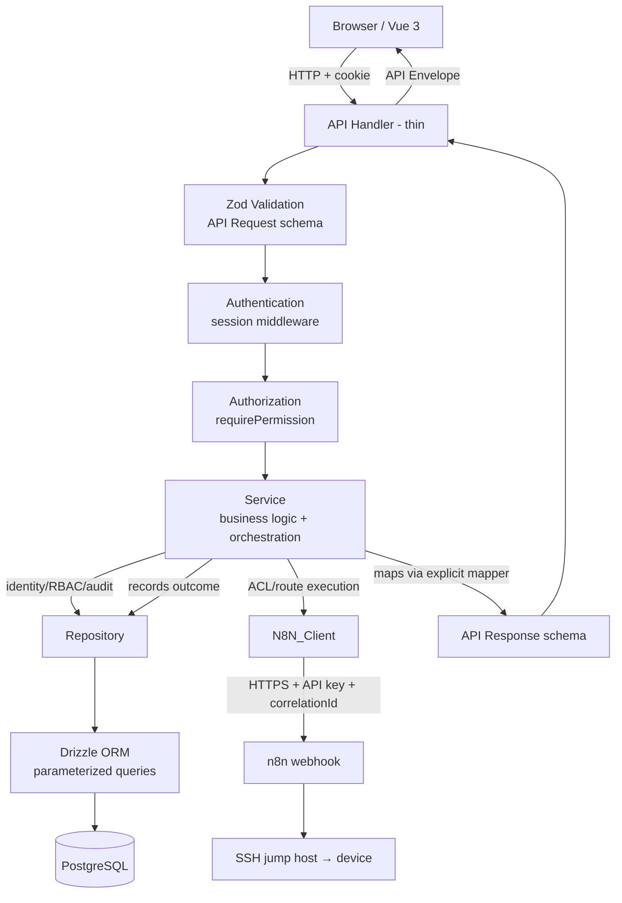
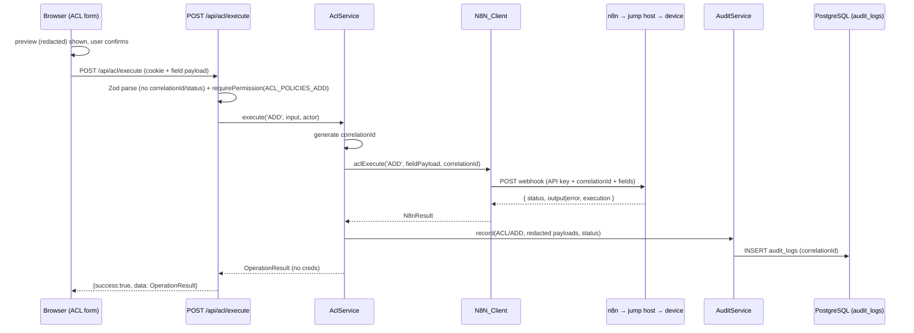

# Design Document

## Overview

NetOps Policy Manager is a single fullstack Nuxt 4 application that gives authenticated, role-scoped operators an interface to run ACL and route operations (show/add/delete) and an immutable audit trail of every one of them. It does not execute anything against network devices itself and does not store network device configuration: execution is delegated to an external **n8n** workflow (behind an SSH jump host), and this application's PostgreSQL database is an **audit/logging layer, not the source of truth** for ACL/route state.

The application is delivered as one Nuxt app running on the Nitro server. Vue 3 renders the frontend; Nitro hosts the `/api` endpoints. All authentication, authorization, validation, redaction, n8n orchestration, and audit persistence run on the server. PostgreSQL (accessed through Drizzle ORM) is the only local datastore and holds identity, RBAC, sessions, and audit logs. The whole thing ships as a single multi-stage Docker image.

For add/delete operations the app shows a **redacted command preview** (built from a static template + the operator's field values) so the engineer can review what will happen, then — on explicit confirmation — forwards the **field payload** (not the rendered command) to n8n over an authenticated webhook, waits for the result, and records it. A single **correlation id** links the whole chain (Web App request → n8n execution → device command → device response).

This design maps directly to the requirements in `requirements.md`; requirement numbers are referenced inline where a design decision satisfies a specific acceptance criterion. The n8n webhook contract, payloads, API-key auth, and command templates are detailed in the **n8n Integration** spec (`.kiro/specs/n8n-integration/`).

### Design Goals

- **Server-authoritative security** — every auth/authorization/validation/redaction step runs server-side, independent of the frontend (Req 2.8, NFR Security 4).
- **Interface + audit system of record** — the app captures intent and outcome; device state lives on devices, reached only through n8n. The DB stores audit logs, not ACL/route rows (Req 8, Req 10).
- **Delegated execution** — the app never opens a device session; it forwards field payloads to n8n and records the result (Req 7).
- **Credential safety** — the per-engineer Execution_Credentials are forwarded to n8n but never persisted and never shown; they appear only as `***` in previews, responses, and audit (Req 7, NFR Security 7).
- **End-to-end traceability** — one correlation id ties request → n8n → device command → response together on the audit log (Req 8.5).
- **Explicit, safe deployment** — no DB provisioning, no auto-migrate, no embedded fallback, validated env at startup (Req 14).

## Architecture

### Request Flow

```
Browser (Vue 3 SPA/SSR)
   │  HTTP + HttpOnly session cookie
   ▼
Nuxt app (Nitro server)
   ├── Vue frontend (pages, components, composables)
   └── Nitro backend (/api handlers → services → { repositories | N8N_Client })
             │                                        │
             ▼                                        ▼
     PostgreSQL (via Drizzle)                 n8n webhook (HTTPS + API key)
     identity/RBAC/sessions/audit                     │
                                                       ▼
                                              SSH jump host → device
```

There is one deployable unit for this app. The browser talks only to the Nuxt app. The Nuxt app talks to PostgreSQL (for identity, RBAC, sessions, and audit) and to n8n (for ACL/route execution). It never talks to a device directly — n8n owns the SSH jump host and the device credentials.

### Layering

Every mutating API request passes through the same ordered pipeline. Each layer has one responsibility and hands a narrower, more-typed value to the next.



For ACL/route operations the service is an **orchestrator**, not a persistence writer: it validates, builds the redacted preview (add/delete), calls `N8N_Client` with the field payload + correlation id, then writes one audit log capturing the request, the redacted command snapshot, the n8n execution metadata, and the device response. There is no ACL/route table to write to.

Ordering note: the session middleware (Authentication) runs globally and populates `event.context.auth` before handlers execute, so in the handler body the effective order is validate input → `requirePermission` → service. Authentication is resolved earlier in the middleware chain (Req 2.5, 2.6).

Responsibilities:

- **API Handler (thin)** — parse request, delegate, wrap the result in the API Envelope. No business logic. (Req 12.1, 12.2)
- **Zod Validation** — parse the request body/query with an explicit API Request schema that excludes server-controlled fields (`id`, `correlationId`, `created_at`, audit `status`). (Req 11.4, 13.5)
- **Authentication** — session middleware resolves the current user + permissions from the session cookie, or leaves the context unauthenticated. (Req 1, Req 2.5)
- **Authorization** — `requirePermission(event, perm)` throws 401 if unauthenticated, 403 if the user lacks the permission. (Req 2.6)
- **Service** — business logic. For identity/user mutations it owns the DB transaction (row change + audit entry in one tx, Req 8.4). For ACL/route it orchestrates: validate → redact/preview → call `N8N_Client` with the field payload + correlationId → record one audit log (SUCCESS/FAILED). It never composes or runs a device command itself. (Req 4, 6, 7)
- **N8N_Client** (`server/network/`) — the only layer that calls n8n; POSTs the field payload with the API key + correlationId and normalizes the result. (Req 7.4, 7.5)
- **Repository** — the only layer that knows Drizzle; exposes typed methods returning domain models. There are no ACL/route repositories. (Req 10.8)
- **Drizzle → PostgreSQL** — parameterized queries only. (Req 10.8)

### Model Separation

Model layers are all derived from Zod schemas via `z.infer` (Req 11.1, 11.2). Explicit mapper functions convert between adjacent layers. **DB rows are never returned to the frontend** (Req 11.3).

For identity/RBAC/audit (the parts this app persists), the layering is unchanged from a normal DB app:

| Layer | Origin | Purpose | Crosses to client? |
|-------|--------|---------|--------------------|
| DB model | Drizzle table `$inferSelect` | Exact row shape (users, sessions, audit_logs, …) | No |
| Domain model | Zod domain schema | Business objects used inside services | No |
| API Request model | Zod request schema | Accepted input, excludes server-controlled fields | Inbound only |
| API Response model | Zod response schema | Safe outbound shape, excludes secrets | Yes |
| UI Form model | Zod form schema (shared) | Frontend form state + client validation | Client-side |

For ACL/route operations there is **no DB model** — the app does not store ACL/route rows. Instead the flow is:

```
UI Form ──▶ API Request (field payload) ──validate/redact──▶ N8N field payload ──▶ n8n
n8n response ──▶ Operation Result (Zod) ──▶ client
                  └──▶ Audit_Log (request/command/execution/response JSONB) ──▶ PostgreSQL
```

Server-controlled fields (`id`, `correlation_id`, `created_at`, and the audit `status`) are never present on API Request schemas, so a client cannot set them (Req 11.4); the server sets them. The Command_Preview string is produced by the server and returned for display only — it is not part of the request the client can spoof, and it is not sent to n8n.

## Project Structure

Nuxt 4 convention: application (client + universal) code lives under `app/` (using `srcDir: 'app'`), and server code lives under `server/`. Nuxt auto-imports `server/api/**` as routes based on file name (e.g. `server/api/acl/show.post.ts` → `POST /api/acl/show`). `shared/` holds code safe for both client and server (Zod schemas, contracts, constants). `database/` holds Drizzle schema, migrations, and seeds and is used by the server and by CLI scripts.

```
netops-policy-manager/
├── app/
│   ├── assets/                      # css (tailwind entry), images
│   ├── components/
│   │   ├── layout/AppSidebar.vue
│   │   ├── layout/AppHeader.vue
│   │   ├── PageHeader.vue
│   │   ├── DataTable.vue
│   │   ├── StatusBadge.vue
│   │   ├── FormField.vue
│   │   ├── ConfirmDialog.vue
│   │   ├── LoadingState.vue
│   │   ├── EmptyState.vue
│   │   ├── ErrorState.vue
│   │   └── Pagination.vue
│   ├── composables/
│   │   ├── useAuth.ts
│   │   ├── usePermissions.ts
│   │   └── useApi.ts                # envelope-aware fetch wrapper
│   ├── layouts/
│   │   ├── auth.vue                 # bare layout for /login
│   │   └── default.vue              # app shell: AppSidebar + AppHeader
│   ├── middleware/
│   │   ├── auth.global.ts           # redirect to /login if unauthenticated
│   │   └── permission.ts            # named route middleware, gates by permission
│   ├── pages/
│   │   ├── login.vue
│   │   ├── index.vue                # dashboard
│   │   ├── acl/
│   │   │   ├── index.vue
│   │   │   └── [id].vue
│   │   ├── routes/
│   │   │   ├── index.vue
│   │   │   └── [id].vue
│   │   ├── administration/
│   │   │   └── users/
│   │   │       ├── index.vue
│   │   │       └── [id].vue
│   │   └── logs/
│   │       ├── index.vue
│   │       └── [id].vue
│   ├── utils/                       # client-only helpers (formatting, etc.)
│   └── app.vue
├── server/
│   ├── api/
│   │   ├── health.get.ts
│   │   ├── auth/
│   │   │   ├── login.post.ts
│   │   │   ├── logout.post.ts
│   │   │   └── me.get.ts
│   │   ├── users/
│   │   │   ├── index.get.ts
│   │   │   ├── index.post.ts
│   │   │   ├── [id].get.ts
│   │   │   ├── [id].patch.ts
│   │   │   ├── [id]/role.patch.ts
│   │   │   ├── [id]/status.patch.ts
│   │   │   └── [id]/reset-password.post.ts
│   │   ├── acl/
│   │   │   ├── show.post.ts         # read-only show via n8n (no confirm)
│   │   │   ├── preview.post.ts      # build redacted Command_Preview (add/delete)
│   │   │   └── execute.post.ts      # confirmed add/delete → n8n → audit
│   │   ├── routes/
│   │   │   ├── show.post.ts
│   │   │   ├── preview.post.ts
│   │   │   └── execute.post.ts
│   │   ├── audit/
│   │   │   ├── index.get.ts
│   │   │   ├── [id].get.ts
│   │   │   └── export.get.ts
│   │   └── dashboard/
│   │       └── summary.get.ts
│   ├── auth/
│   │   ├── password.ts              # argon2 hash/verify
│   │   ├── session.ts               # token gen, hash, cookie helpers
│   │   └── permissions.ts           # permission codes + hasPermission/requirePermission (resolves from DB)
│   ├── services/
│   │   ├── auth.service.ts
│   │   ├── user.service.ts
│   │   ├── acl.service.ts
│   │   ├── route.service.ts
│   │   ├── audit.service.ts
│   │   └── dashboard.service.ts
│   ├── repositories/                # DB access only — no acl/route repos (no such tables)
│   │   ├── user.repository.ts
│   │   ├── session.repository.ts
│   │   └── audit.repository.ts      # insert + query audit_logs
│   ├── domain/
│   │   ├── user.ts
│   │   └── audit.ts                 # domain types (z.infer) + mappers
│   ├── network/                     # n8n integration boundary (Req 7.6)
│   │   ├── n8n-client.ts            # calls n8n webhook: HTTPS + API key + correlationId
│   │   ├── command-templates.ts     # 4 static preview templates (ACL/route × add/delete)
│   │   ├── preview.ts               # render template + field values, then redact
│   │   └── redact.ts                # replace Execution_Credentials with ***
│   ├── middleware/
│   │   └── 01.session.ts            # global: resolve session → event.context.auth
│   ├── validators/                  # server-side request/query parse helpers
│   ├── utils/
│   │   ├── envelope.ts              # ok()/fail() envelope helpers
│   │   ├── errors.ts                # AppError, error codes, central handler
│   │   └── config.ts               # EnvSchema validation at startup
│   └── plugins/
│       └── validate-env.ts          # runs config validation on Nitro startup (Req 14.2/14.3)
├── shared/
│   ├── schemas/                     # Zod: network primitives, acl, route, user, audit, pagination
│   │   ├── network.ts               # IPv4/CIDR/port/protocol/time/change-ticket primitives
│   │   ├── acl.ts                   # ACL show-filter + add/delete field payloads
│   │   ├── route.ts                 # route show-filter + add/delete field payloads
│   │   ├── user.ts
│   │   ├── audit.ts                 # audit query + response (incl. 4 JSONB payloads)
│   │   ├── n8n.ts                   # n8n request/response contract (see n8n-integration spec)
│   │   └── common.ts                # pagination, envelope types, correlationId
│   ├── contracts/                   # API request/response contract types
│   ├── types/                       # shared z.infer type exports
│   └── constants/                   # roles, permissions labels, enums
├── database/
│   ├── schema/
│   │   ├── users.ts                 # includes nullable role_id FK → roles
│   │   ├── roles.ts
│   │   ├── permissions.ts
│   │   ├── roles-permissions.ts
│   │   ├── sessions.ts
│   │   ├── user-mfa.ts
│   │   ├── audit-logs.ts            # audit/logging layer (no acl_policies/routes tables)
│   │   └── index.ts                 # re-export + enums
│   ├── migrations/                  # generated by db:generate
│   ├── seeds/
│   │   └── seed.ts                  # roles + initial admin from env (Req 15.3/15.4)
│   └── index.ts                     # drizzle client factory
├── tests/
│   ├── unit/                        # schemas, redaction, preview, rbac, mappers (no DB, no n8n)
│   └── integration/                 # handlers with mocked repos + mocked N8N_Client
├── public/
├── Dockerfile
├── .dockerignore
├── .env.example
├── drizzle.config.ts
├── nuxt.config.ts
├── tsconfig.json
├── vitest.config.ts
└── package.json
```

Nuxt convention adjustments:
- `srcDir: 'app'` places pages/components/composables/layouts/middleware under `app/`.
- `server/api/**` filenames encode HTTP method and path; nested folders (e.g. `[id]/role.patch.ts`) create sub-routes.
- `shared/` is auto-importable on both client and server, which is why all Zod schemas live there (single source of types, Req 11.2).
- `server/middleware/01.session.ts` uses a numeric prefix so it runs before route handlers.

## Data Models

### Enums

```typescript
// database/schema/index.ts
import { pgEnum } from 'drizzle-orm/pg-core';

export const authProviderEnum = pgEnum('auth_provider', ['LOCAL', 'AD']);   // account origin (users)
export const mfaTypeEnum      = pgEnum('mfa_type',      ['TOTP']);          // second-factor type (user_mfa)
// User active/disabled state is a boolean `users.is_active`, not an enum.
export const auditModuleEnum = pgEnum('audit_module', ['AUTH', 'USER', 'ACL', 'ROUTE', 'N8N']);   // Req 8.1
export const auditActionEnum = pgEnum('audit_action', ['LOGIN', 'SHOW', 'ADD', 'DELETE', 'UPDATE']); // Req 8.1
export const auditStatusEnum = pgEnum('audit_status', ['SUCCESS', 'FAILED']);                     // Req 8.2
```

There are **no** `acl_status`, `route_status`, `protocol`, or `acl_action` database enums — ACL/route data is never persisted. Protocol/action/status choices for ACL/route *input* are enforced by Zod on the form and server (see Zod schemas below), not by a DB enum.

### Drizzle Schema

Requirement mapping: UUID primary keys (Req 10.3), unique email login identifier (Req 10.4), FKs (Req 10.5), no duplicate permission assignments per role (Req 10.6), indexes (Req 10.7). This app persists identity, RBAC, sessions, and audit only — there are no `acl_policies` or `routes` tables (Req 10.1, 10.2).

> The RBAC tables below (`roles`, `permissions`, `roles_permissions`, and the `users.role_id` column) are specified in full — with initial data, initial mapping, and constraints — in the dedicated **RBAC & Permissions** spec (`.kiro/specs/rbac-permissions/design.md`). They are summarized here so the identity schema reads as a whole.

```typescript
// database/schema/users.ts — identity foundation (LOCAL + AD)
import { sql } from 'drizzle-orm';
import { pgTable, uuid, varchar, text, boolean, timestamp, pgEnum, index, uniqueIndex } from 'drizzle-orm/pg-core';
import { roles } from './roles';

export const authProviderEnum = pgEnum('auth_provider', ['LOCAL', 'AD']);   // account origin

export const users = pgTable('users', {
  userId: uuid('user_id').primaryKey().defaultRandom(),
  email: varchar('email', { length: 255 }).notNull(),                       // login identifier (unique)
  displayName: varchar('display_name', { length: 150 }).notNull(),
  username: varchar('username', { length: 300 }),                           // AD sAMAccountName; NULL for LOCAL; additional login id (partial-unique)
  passwordHash: text('password_hash'),                                      // NULLABLE: null for AD accounts (NFR Sec 1)
  authProvider: authProviderEnum('auth_provider').notNull().default('LOCAL'),
  externalId: varchar('external_id', { length: 255 }),                      // immutable AD id (objectGUID as GUID string); unique
  roleId: uuid('role_id').references(() => roles.roleId, { onDelete: 'restrict' }), // nullable; one role per user (RBAC spec)
  isActive: boolean('is_active').notNull().default(true),
  lastLoginAt: timestamp('last_login_at', { withTimezone: true }),
  createdAt: timestamp('created_at', { withTimezone: true }).notNull().defaultNow(),
  updatedAt: timestamp('updated_at', { withTimezone: true }).notNull().defaultNow(),
}, (t) => [
  uniqueIndex('users_email_uidx').on(t.email),                              // Req 10.3
  uniqueIndex('users_external_id_uidx').on(t.externalId),                   // recognize returning AD users
  // Partial-unique: usernames unique among AD accounts; NULL LOCAL rows don't collide.
  uniqueIndex('users_username_uidx').on(t.username).where(sql`${t.username} IS NOT NULL`),
  index('users_role_id_idx').on(t.roleId),                                  // Req 10.6
]);
```

The `users` table is the identity foundation for both account origins. LOCAL accounts carry an Argon2 `passwordHash`; AD accounts have `passwordHash = null` and are recognized on return by `externalId` (see the Active Directory Authentication spec). Users log in with an `email` **or** — for AD accounts — their `username` (AD `sAMAccountName`); `username` is nullable (LOCAL accounts have none) and partial-unique. `status` is represented by the boolean `isActive` rather than an enum.

```typescript
// database/schema/roles.ts — master role table (data-driven RBAC)
export const roles = pgTable('roles', {
  roleId: uuid('role_id').primaryKey().defaultRandom(),
  roleCode: varchar('role_code', { length: 50 }).notNull().unique(),  // ADMINISTRATOR | L2_ENGINEER | NOC | future
  roleName: varchar('role_name', { length: 100 }).notNull(),
  description: text('description'),
  isActive: boolean('is_active').notNull().default(true),
  createdAt: timestamp('created_at', { withTimezone: true }).notNull().defaultNow(),
  updatedAt: timestamp('updated_at', { withTimezone: true }).notNull().defaultNow(),
});
```

```typescript
// database/schema/permissions.ts — feature + action capabilities
export const permissions = pgTable('permissions', {
  permissionId: uuid('permission_id').primaryKey().defaultRandom(),
  permissionCode: varchar('permission_code', { length: 100 }).notNull().unique(), // e.g. ACL_POLICIES_ADD
  feature: varchar('feature', { length: 50 }).notNull(),   // ACL_POLICIES | ROUTES | ADMINISTRATION
  action: varchar('action', { length: 30 }).notNull(),     // SHOW | ADD | DELETE | MANAGE
  description: text('description'),
  isActive: boolean('is_active').notNull().default(true),
  createdAt: timestamp('created_at', { withTimezone: true }).notNull().defaultNow(),
  updatedAt: timestamp('updated_at', { withTimezone: true }).notNull().defaultNow(),
}, (t) => ({
  featureActionUq: uniqueIndex('permissions_feature_action_uidx').on(t.feature, t.action), // Req 10 / RBAC
}));
```

```typescript
// database/schema/roles-permissions.ts — role→permission mapping (many-to-many)
export const rolesPermissions = pgTable('roles_permissions', {
  rolePermissionId: uuid('role_permission_id').primaryKey().defaultRandom(),
  roleId: uuid('role_id').notNull().references(() => roles.roleId, { onDelete: 'cascade' }),
  permissionId: uuid('permission_id').notNull().references(() => permissions.permissionId, { onDelete: 'cascade' }),
  createdAt: timestamp('created_at', { withTimezone: true }).notNull().defaultNow(),
}, (t) => ({
  rolePermUq: uniqueIndex('roles_permissions_role_perm_uidx').on(t.roleId, t.permissionId), // Req 10.5
}));
```

The `users` table gains a nullable `role_id` FK (one role per user for now). The FK uses **`ON DELETE RESTRICT`** so a role that is still assigned to any user cannot be deleted — retiring a role is done by setting `roles.is_active = false`, not by deletion. A user with `role_id = null` holds no feature permissions.

```typescript
// database/schema/users.ts — role_id addition (see RBAC spec for the migration)
//   roleId: uuid('role_id').references(() => roles.roleId, { onDelete: 'restrict' }),  // nullable
```

```typescript
// database/schema/sessions.ts — authenticated sessions (created only after the second factor)
import { pgTable, uuid, text, varchar, timestamp, index, uniqueIndex } from 'drizzle-orm/pg-core';
import { users } from './users';

export const sessions = pgTable('sessions', {
  sessionId: uuid('session_id').primaryKey().defaultRandom(),
  userId: uuid('user_id').notNull().references(() => users.userId, { onDelete: 'cascade' }),
  tokenHash: text('token_hash').notNull(),                                 // SHA-256 of the raw token only (Req 1.7, NFR Sec 2)
  expiresAt: timestamp('expires_at', { withTimezone: true }).notNull(),    // Req 1.9
  createdAt: timestamp('created_at', { withTimezone: true }).notNull().defaultNow(),
  lastUsedAt: timestamp('last_used_at', { withTimezone: true }),           // Req 1.9
  sourceIp: varchar('source_ip', { length: 64 }),
  userAgent: varchar('user_agent', { length: 512 }),
}, (t) => [
  uniqueIndex('sessions_token_hash_uidx').on(t.tokenHash),
  index('sessions_user_id_idx').on(t.userId),
  index('sessions_expires_at_idx').on(t.expiresAt),
]);
```

```typescript
// database/schema/user-mfa.ts — TOTP second-factor devices (shared by LOCAL and AD users)
import { pgTable, uuid, text, boolean, timestamp, index } from 'drizzle-orm/pg-core';
import { users } from './users';
import { mfaTypeEnum } from './index';

// A user may enrol up to MFA_DEVICE_LIMIT (2) TOTP devices; the cap is enforced
// in the service layer, so there is intentionally NO unique index on user_id.
export const userMfa = pgTable('user_mfa', {
  mfaId: uuid('mfa_id').primaryKey().defaultRandom(),
  userId: uuid('user_id').notNull().references(() => users.userId, { onDelete: 'cascade' }),
  mfaType: mfaTypeEnum('mfa_type').notNull().default('TOTP'),
  label: text('label').notNull().default('Authenticator'),
  secretEncrypted: text('secret_encrypted').notNull(),                     // AES-256-GCM at rest (NFR Sec 3)
  isEnabled: boolean('is_enabled').notNull().default(false),               // true only after first code confirmed
  verifiedAt: timestamp('verified_at', { withTimezone: true }),
  createdAt: timestamp('created_at', { withTimezone: true }).notNull().defaultNow(),
  updatedAt: timestamp('updated_at', { withTimezone: true }).notNull().defaultNow(),
}, (t) => [
  index('user_mfa_user_id_idx').on(t.userId),
]);
```

A session row exists only after the TOTP second factor tied to an MFA_Challenge succeeds (Req 1.5, 1.7). The raw session token is never stored — only its SHA-256 hash — and lives client-side solely in the `netops_session` HttpOnly cookie. The pre-auth MFA_Challenge itself is **not** a table: it is a short-lived, HMAC-signed cookie (`netops_mfa_challenge`, keyed by `SESSION_SECRET`, TTL `MFA_CHALLENGE_TTL_MINUTES`) carrying the user id and purpose (`MFA_ENROLLMENT | MFA_LOGIN`).

There are intentionally **no** `acl_policies` or `routes` tables. This application does not store network device configuration state (Req 10.1, 10.2); ACL/route data flows through as a field payload to n8n and is recorded only as an audit log.

```typescript
// database/schema/audit-logs.ts — the single operational record (system of record)
import { pgTable, uuid, varchar, timestamp, jsonb, index } from 'drizzle-orm/pg-core';
import { users } from './users';
import { auditModuleEnum, auditActionEnum, auditStatusEnum } from './index';

export const auditLogs = pgTable('audit_logs', {
  id: uuid('id').primaryKey().defaultRandom(),
  userId: uuid('user_id').references(() => users.userId, { onDelete: 'set null' }), // nullable: a failed login may have no known user
  username: varchar('username', { length: 150 }),          // snapshot at action time (Req 8.2)
  userRole: varchar('user_role', { length: 100 }),         // snapshot at action time
  module: auditModuleEnum('module').notNull(),             // AUTH | USER | ACL | ROUTE | N8N (Req 8.1)
  action: auditActionEnum('action').notNull(),             // LOGIN | SHOW | ADD | DELETE | UPDATE (Req 8.1)
  status: auditStatusEnum('status').notNull(),             // SUCCESS | FAILED (Req 8.6)
  sourceIp: varchar('source_ip', { length: 64 }),
  userAgent: varchar('user_agent', { length: 512 }),
  correlationId: uuid('correlation_id').notNull(),         // links request → n8n → device (Req 8.5)
  createdAt: timestamp('created_at', { withTimezone: true }).notNull().defaultNow(),
  // Four flexible JSONB payloads (Req 8.3). Shapes may evolve with n8n without a
  // migration to the fixed columns (Req 8.12). Never contain raw credentials/secrets.
  requestPayload: jsonb('request_payload'),                // submitted field values / show filter
  commandPayload: jsonb('command_payload'),                // REDACTED command snapshot, e.g. { device, command: [...] }
  executionPayload: jsonb('execution_payload'),            // n8n metadata: executor, workflow_id, execution_id, timings
  responsePayload: jsonb('response_payload'),              // device output or error: { device, output } | { device, error }
}, (t) => ({
  createdAtIdx: index('audit_created_at_idx').on(t.createdAt),      // Req 10.7
  userIdx: index('audit_user_id_idx').on(t.userId),
  moduleIdx: index('audit_module_idx').on(t.module),
  actionIdx: index('audit_action_idx').on(t.action),
  statusIdx: index('audit_status_idx').on(t.status),
  correlationIdx: index('audit_correlation_id_idx').on(t.correlationId),
}));
```

There is **no** endpoint or repository method that deletes or mutates audit rows during normal operation (Req 8.7). The four JSONB columns are the flexibility point: their internal shape can track n8n's evolving request/response without altering the fixed columns (Req 8.12). Redaction of the Execution_Credentials to `***` happens before any write, so credentials never reach `request_payload` or `command_payload` (Req 8.4).

### Zod Application Schemas

All schemas live under `shared/schemas/` and are the source of application types via `z.infer` (Req 11.2). Empty strings are rejected for required fields (Req 5.9), and description fields are length-capped (Req 5.10).

#### Network primitives (`shared/schemas/network.ts`) — Req 5.1

```typescript
import { z } from 'zod';

// IPv4 accepted; other forms rejected (Req 5.2)
export const Ipv4Schema = z.string().ip({ version: 'v4' });

// IPv4 or IPv6 (Req 5.4)
export const IpAddressSchema = z.string().ip();

// ip/prefix, prefix 0..32 for v4 (Req 5.3)
export const CidrSchema = z.string().refine(isValidCidr, { message: 'Invalid CIDR notation' });

// integer 1..65535 (Req 5.5)
export const PortSchema = z.number().int().min(1).max(65535);

export const ProtocolSchema = z.enum(['TCP', 'UDP', 'ICMP', 'ANY']);  // Req 5.6

// HH:MM 24h (Req 5.7)
export const TimeSchema = z.string().regex(/^([01]\d|2[0-3]):[0-5]\d$/, 'Invalid time');

// e.g. CHG-123456 (Req 5.8)
export const ChangeTicketSchema = z.string().min(1).regex(/^[A-Z]+-\d+$/, 'Invalid change ticket');

const DescriptionSchema = z.string().max(1000);  // Req 5.10
```

#### ACL schemas (`shared/schemas/acl.ts`) — Req 4

These are **request payloads and a show filter**, not DB rows — the app stores no ACL rows. Field names/shapes are the app's contract with n8n and may be tuned to n8n's needs (see the n8n Integration spec). The Execution_Credentials are a separate, redaction-tracked object reused across add/delete/show.

```typescript
// Per-engineer credentials supplied on every operation, forwarded to n8n, never
// persisted, never returned to the client, and redacted to *** in preview/audit.
export const ExecCredentialsSchema = z.object({
  execUsername: z.string().min(1).max(128),
  execPassword: z.string().min(1).max(256),
});

// ACL SHOW — read-only, executes immediately (no confirm). A single filter value.
export const AclShowSchema = z.object({
  filter: z.string().min(1).max(256),   // e.g. an IP or ACL name to grep for
}).merge(ExecCredentialsSchema);

// ACL ADD field payload (fields MAY be tuned to n8n). Cross-field port rules apply.
const AclAddBase = z.object({
  name: z.string().min(1).max(128),
  source: z.string().min(1),                 // Ipv4 / Cidr / 'any'
  sourceMask: z.string().min(1).optional(),
  destination: z.string().min(1),
  destinationMask: z.string().min(1).optional(),
  protocol: ProtocolSchema,                  // Req 4.4
  port: PortSchema.optional(),
  action: z.enum(['ALLOW', 'DENY']),         // Req 4.7
  timeStart: TimeSchema.optional(),
  timeEnd: TimeSchema.optional(),
  changeTicket: ChangeTicketSchema.optional(),
  description: DescriptionSchema.optional(),
});
const withPortRules = <T extends z.ZodType>(s: T) => s.superRefine((v: any, ctx) => {
  if ((v.protocol === 'TCP' || v.protocol === 'UDP') && v.port === undefined) {
    ctx.addIssue({ code: 'custom', path: ['port'], message: 'Port required for TCP/UDP' }); // Req 4.5
  }
  if (v.protocol === 'ICMP' && v.port !== undefined) {
    ctx.addIssue({ code: 'custom', path: ['port'], message: 'ICMP must not have a port' }); // Req 4.6
  }
});
export const AclAddSchema = withPortRules(AclAddBase.merge(ExecCredentialsSchema));

// ACL DELETE field payload — the identifying fields needed to remove the rule.
export const AclDeleteSchema = z.object({
  name: z.string().min(1).max(128),
  source: z.string().min(1),
  destination: z.string().min(1),
  changeTicket: ChangeTicketSchema.optional(),
}).merge(ExecCredentialsSchema);

// Preview request: which operation to preview + its field payload (no confirm yet).
export const AclPreviewSchema = z.discriminatedUnion('operation', [
  z.object({ operation: z.literal('ADD') }).merge(AclAddBase).merge(ExecCredentialsSchema),
  z.object({ operation: z.literal('DELETE'), name: z.string(), source: z.string(), destination: z.string() }).merge(ExecCredentialsSchema),
]);
```

The server builds the redacted Command_Preview from these fields; it never trusts a client-supplied preview string, `correlationId`, or audit `status` (Req 11.4).

#### Route schemas (`shared/schemas/route.ts`) — Req 6

Mirrors ACL: show filter + add/delete field payloads, no DB rows, credentials redaction-tracked.

```typescript
// Route SHOW — read-only, immediate (no confirm).
export const RouteShowSchema = z.object({
  filter: z.string().min(1).max(256),   // e.g. a destination or next hop
}).merge(ExecCredentialsSchema);

// Route ADD field payload
export const RouteAddSchema = z.object({
  name: z.string().min(1).max(128),
  destination: CidrSchema,               // Req 6.4
  source: z.string().min(1).optional(),
  nextHop: IpAddressSchema,              // Req 6.5
  policy: z.string().max(128).optional(),
  timeStart: TimeSchema.optional(),
  timeEnd: TimeSchema.optional(),
  changeTicket: ChangeTicketSchema.optional(),
}).merge(ExecCredentialsSchema);

// Route DELETE field payload
export const RouteDeleteSchema = z.object({
  destination: CidrSchema,
  nextHop: IpAddressSchema.optional(),
  changeTicket: ChangeTicketSchema.optional(),
}).merge(ExecCredentialsSchema);

export const RoutePreviewSchema = z.discriminatedUnion('operation', [
  z.object({ operation: z.literal('ADD') }).merge(RouteAddSchema.omit({ execUsername: true, execPassword: true })).merge(ExecCredentialsSchema),
  z.object({ operation: z.literal('DELETE') }).merge(RouteDeleteSchema.omit({ execUsername: true, execPassword: true })).merge(ExecCredentialsSchema),
]);
```

The shared **Operation Result** returned to the client after a show/execute (`shared/schemas/n8n.ts`) exposes the outcome without secrets:

```typescript
export const OperationResultSchema = z.object({
  correlationId: z.string().uuid(),
  status: z.enum(['SUCCESS', 'FAILED']),
  output: z.string().nullable(),        // raw device output for the terminal box (show/add/delete)
  error: z.string().nullable(),         // safe error message when FAILED (never leaks creds/secrets)
});
```

#### User schemas (`shared/schemas/user.ts`) — Req 3

```typescript
// Administration create — LOCAL user with a role. roleCode is validated against
// existing active roles at runtime (not a hardcoded union), so new roles work
// without a code change (see RBAC spec). AD users are NOT created here — they
// are provisioned just-in-time on first AD login.
export const AdminCreateUserSchema = z.object({
  email: z.string().trim().toLowerCase().max(255).email(),
  displayName: z.string().trim().min(1).max(150),
  password: z.string().min(8).max(128),        // hashed server-side; never stored raw
  roleCode: z.string().trim().min(1).max(50),  // e.g. ADMINISTRATOR | L2_ENGINEER | NOC | future
});
export const AdminUpdateUserSchema = z.object({ displayName: z.string().trim().min(1).max(150) });
export const AdminChangeRoleSchema = z.object({ roleCode: z.string().trim().min(1).max(50) });  // Req 3.4
export const AdminSetStatusSchema  = z.object({ isActive: z.boolean() });                        // Req 3.5
export const AdminResetPasswordSchema = z.object({ password: z.string().min(8).max(128) });      // Req 3.6

// Safe user shape. Never exposes password, passwordHash, externalId, or token (Req 3.7, NFR Sec 6).
export const UserResponseSchema = z.object({
  userId: z.string().uuid(),
  email: z.string().email(),
  displayName: z.string(),
  username: z.string().nullable(),   // AD sAMAccountName; null for LOCAL. Shown in the profile.
  authProvider: z.enum(['LOCAL', 'AD']),
  isActive: z.boolean(),
  lastLoginAt: z.date().nullable(),
  createdAt: z.date(),
  updatedAt: z.date(),
});
```

Reset-password applies only to LOCAL accounts; AD accounts have no NetOps-stored password to reset (Req 1.16). The Administration user row surfaced to the client carries the joined `roleCode` / `roleName` (null when unassigned) but never `externalId` or any secret.

#### Audit, pagination, env (`shared/schemas/audit.ts`, `shared/schemas/common.ts`, `server/utils/config.ts`)

```typescript
// Pagination query (Req 12.6) — clamps limit to a max, offset >= 0
export const PaginationQuerySchema = z.object({
  page: z.coerce.number().int().min(1).default(1),
  limit: z.coerce.number().int().min(1).max(100).default(20),
  search: z.string().optional(),
});

export const AuditQuerySchema = PaginationQuerySchema.extend({
  module: z.enum(['AUTH', 'USER', 'ACL', 'ROUTE', 'N8N']).optional(),  // Req 8.8
  action: z.enum(['LOGIN', 'SHOW', 'ADD', 'DELETE', 'UPDATE']).optional(),
  status: z.enum(['SUCCESS', 'FAILED']).optional(),
  correlationId: z.string().uuid().optional(),   // pull the whole trail of one operation
  from: z.string().optional(),                   // date filter (Req 8.8)
  to: z.string().optional(),
});

// Safe outbound audit shape (Req 8.9). JSONB payloads are already redacted at
// write time, so they are safe to surface; they are typed unknown because the
// shape is intentionally flexible (Req 8.12).
export const AuditResponseSchema = z.object({
  id: z.string().uuid(),
  createdAt: z.string(),
  userId: z.string().uuid().nullable(),
  username: z.string().nullable(),
  userRole: z.string().nullable(),
  module: z.enum(['AUTH', 'USER', 'ACL', 'ROUTE', 'N8N']),
  action: z.enum(['LOGIN', 'SHOW', 'ADD', 'DELETE', 'UPDATE']),
  status: z.enum(['SUCCESS', 'FAILED']),
  sourceIp: z.string().nullable(),
  userAgent: z.string().nullable(),
  correlationId: z.string().uuid(),
  requestPayload: z.unknown().nullable(),
  commandPayload: z.unknown().nullable(),
  executionPayload: z.unknown().nullable(),
  responsePayload: z.unknown().nullable(),
});

// Startup env validation (Req 14.1, 14.2, 14.3). Validated once by the Nitro
// validate-env plugin. Server-only — there is no runtimeConfig block.
export const EnvSchema = z.object({
  NODE_ENV: z.enum(['development', 'production', 'test']).default('development'),
  DATABASE_URL: z.string().url(),
  SESSION_SECRET: z.string().min(32),
  MFA_ENCRYPTION_KEY: z.string().regex(/^[0-9a-fA-F]{64}$/),   // AES-256-GCM key for TOTP secrets (32 bytes hex)
  SESSION_TTL_HOURS: z.coerce.number().int().positive().default(8),
  MFA_CHALLENGE_TTL_MINUTES: z.coerce.number().int().positive().default(5),
  // Active Directory provider (see ad-authentication spec). AD_URL/BASE_DN/BIND_*
  // are required only when AD_ENABLED is true (conditional refinement).
  AD_ENABLED: z.coerce.boolean().default(false),
  AUTH_LOCAL_ENABLED: z.coerce.boolean().default(true),
  AD_URL: z.string().optional(),
  AD_BASE_DN: z.string().optional(),
  AD_BIND_DN: z.string().optional(),
  AD_BIND_PASSWORD: z.string().optional(),
  AD_TIMEOUT_MS: z.coerce.number().int().positive().default(5000),
  // n8n integration (see n8n-integration spec). Required for ACL/route execution.
  // The API key is server-side only and never exposed via runtimeConfig.public.
  N8N_BASE_URL: z.string().url(),                              // base for the ACL/route webhooks
  N8N_API_KEY: z.string().min(1),                             // sent to n8n on every call; never returned to the client
  N8N_TIMEOUT_MS: z.coerce.number().int().positive().default(15000),
  // SEED_USER_* consumed by db:seed (dev LOCAL admin), not required at runtime.
});
```

## Components and Interfaces

### Authentication (`server/auth/`, `server/services/`, `server/utils/`)

Authentication is a two-step flow: a **first factor** (LOCAL password check or AD bind) issues a signed pre-auth MFA_Challenge; the **second factor** (TOTP) then creates the session. The first factor is provider-neutral behind a small provider abstraction so LOCAL and AD share one pipeline (see the Active Directory Authentication spec).

- **First factor — LOCAL** (`auth.service.ts`) — `verifyLocalCredentials(db, email, password)` loads the user by email and runs `argon2.verify` against the stored hash, using a static dummy-hash verification for unknown/unusable accounts to keep timing uniform (anti-enumeration). Usable requires `is_active`, `auth_provider = 'LOCAL'`, and a non-null `password_hash` (Req 1.1, 1.13).
- **First factor — AD** (`server/auth/ad/`, ad-authentication spec) — an LDAP bind + search + user-bind; on success the user is resolved by `external_id` or JIT-provisioned. Rejoins the same MFA-challenge step.
- **Password hashing** (`password.service.ts`) — `hashPassword(raw)`, `verifyPassword(hash, raw)` using Argon2id (NFR Sec 1). LOCAL only.
- **MFA / TOTP** (`mfa.service.ts`) — `otplib` generates the secret and verifies 6-digit codes; the secret is encrypted at rest with AES-256-GCM (`MFA_ENCRYPTION_KEY`). Verification uses `epochTolerance: 30` (±one 30s step) so a correct code entered near a window boundary or with minor client/server clock skew is accepted rather than intermittently rejected. Enrollment stores a disabled device and marks it enabled only after the first code is confirmed. Up to `MFA_DEVICE_LIMIT` (2) devices per user (enforced in the service). The client renders the code as six single-digit boxes (`MfaCodeInput`) and auto-submits on the sixth digit. Provider-agnostic — identical for LOCAL and AD (Req 1.4, 1.5).
- **MFA_Challenge** (`utils/mfa-challenge.ts`) — a stateless HMAC-SHA256-signed cookie (`netops_mfa_challenge`, keyed by `SESSION_SECRET`) carrying `{ userId, purpose }` where purpose is `MFA_ENROLLMENT | MFA_LOGIN`; TTL `MFA_CHALLENGE_TTL_MINUTES`. `issueMfaChallenge(event, userId, purpose)` / `readMfaChallenge(event, expectedPurpose)` / `clearMfaChallenge(event)`.
- **Session** (`session.service.ts`) — `createSession(db, event, userId)` mints a raw token (`base64url(randomBytes(32))`), stores only its `sha256` hash in `sessions.token_hash`, and sets the cookie; TTL `SESSION_TTL_HOURS`. `validateSession`, `revokeSession`, `revokeAllUserSessions`. Keyed on `userId` — provider-agnostic (Req 1.7).
- **Session middleware** (`server/middleware/*.session.ts`) — reads the cookie, hashes it, looks up the session, checks expiry (expired → context stays unauthenticated so `requirePermission` yields 401, Req 1.10), resolves the user + effective permissions, refreshes `lastUsedAt`, and sets `event.context.auth = { user, permissions }`.
- **Handlers** — `login.post.ts` (route provider, disabled-account gate, verify first factor, issue MFA_Challenge → `MFA_SETUP_REQUIRED | MFA_REQUIRED`, LOGIN_FAILED on failure — Req 1.1–1.3, 1.13, 1.14), `mfa/setup.post.ts` + `mfa/devices/*` (TOTP enrollment under an `MFA_ENROLLMENT` challenge — Req 1.4), `mfa/verify.post.ts` (verify TOTP under an `MFA_LOGIN` challenge → `createSession` → `AUTHENTICATED`, LOGIN_SUCCESS — Req 1.5, 1.15), `logout.post.ts` (invalidate — Req 1.11, LOGOUT audit), `me.get.ts` (identity + permissions — Req 1.12).

Cookie flags (both `netops_session` and `netops_mfa_challenge`): `HttpOnly`, `SameSite=Lax`, `Path=/`; `Secure` added only when `NODE_ENV==='production'` (Req 1.7, 1.8).

### RBAC (`server/auth/permissions.ts`) — Req 2

Authorization is **data-driven**: roles, permissions, and their mapping live in the database (`roles`, `permissions`, `roles_permissions`), and a user is linked to at most one role via `users.role_id`. Nothing is hardcoded against a role identifier — a new role is provisioned purely as data (a `roles` row plus `roles_permissions` mappings) without any code change. The full schema, initial data, initial mapping, seeding, and enforcement rules are specified in the dedicated **RBAC & Permissions** spec (`.kiro/specs/rbac-permissions/`); this section shows how the rest of the app consumes it.

Permissions are `feature` + `action` pairs, referenced in code by their `permission_code` (`<FEATURE>_<ACTION>`), e.g. `ACL_POLICIES_ADD`, `ROUTES_DELETE`, `ADMINISTRATION_MANAGE`. Features and actions in this phase:

- `ACL_POLICIES`: `SHOW`, `ADD`, `DELETE`
- `ROUTES`: `SHOW`, `ADD`, `DELETE`
- `ADMINISTRATION`: `SHOW`, `MANAGE`

Dashboard and Log Trail are **not** permission-gated — they are available to every authenticated user (Req 2.10, 8.10).

```typescript
// Permission codes are strings resolved from the DB, not a hardcoded union of
// role identifiers. A tiny helper builds a code from a feature + action.
export type PermissionCode = string;                          // e.g. 'ACL_POLICIES_ADD'
export const permissionCode = (feature: string, action: string) => `${feature}_${action}`;

// The session/auth context carries the user's RESOLVED permission codes,
// computed once per request by joining users → roles → roles_permissions →
// permissions (only active roles/permissions count). See the RBAC spec.
interface AuthContext { user: AuthUser; permissions: Set<PermissionCode> }

export function hasPermission(auth: AuthContext, code: PermissionCode): boolean { // Req 2.4
  return auth.permissions.has(code);
}

export function requirePermission(event, code: PermissionCode): AuthUser {        // Req 2.4
  const auth = event.context.auth as AuthContext | undefined;
  if (!auth?.user) throw new AppError('UNAUTHENTICATED', 401);                    // Req 2.5
  if (!hasPermission(auth, code)) throw new AppError('FORBIDDEN', 403);           // Req 2.6
  return auth.user;
}
```

Every protected handler calls `requirePermission` first (e.g. `requirePermission(event, 'ACL_POLICIES_ADD')`); the server enforces this independently of the frontend (Req 2.8, 2.9). A user with `role_id = null` resolves to an empty permission set and is denied every feature action (but still reaches Dashboard and Log Trail).

### Services (`server/services/`)

Identity/user mutations still open one Drizzle transaction wrapping the row change plus its audit insert (Req 8.4). ACL/route operations have **no row to mutate** — they orchestrate n8n and then write a single audit log. Because there is no local ACL/route state, the audit write and the n8n call cannot be one DB transaction; instead the service always records an audit log for the attempt, marking it `SUCCESS` or `FAILED` from the n8n outcome (Req 4.13, 6.10, 8.6). Every audit write is preceded by redaction (Req 8.4).

- **AuthService** — first factor: `verifyLocalCredentials(db, email, password)` (LOCAL) or the AD provider (ad-authentication spec), then `issueMfaChallenge`; second factor: `verifyMfaLogin` → `createSession` + `AUTH/LOGIN SUCCESS`; `logout` → invalidate + `AUTH/LOGIN` logout entry; `me(user)`. `AUTH/LOGIN FAILED` on a failed factor (Req 1.1–1.15).
- **UserService** — `list(query)`, `create` (+`USER/ADD`), `updateBasic` (+`USER/UPDATE`), `changeRole` (+`USER/UPDATE`), `setStatus` (+`USER/UPDATE`), `resetPassword` (Argon2 hash). All reads mapped through `UserResponseSchema` (Req 3.7). One tx per mutation wrapping the row change + audit insert.
- **AclService** — `show(input, actor, ctx)`, `preview(input)`, `execute(operation, input, actor, ctx)`.
  - `show`: validate `AclShowSchema` → generate correlationId → `N8N_Client.aclShow(payload)` → return `OperationResult` (raw output) → record `ACL/SHOW` audit. Read-only, no confirm (Req 4.1, 4.2).
  - `preview`: validate `AclPreviewSchema` → build redacted Command_Preview via `renderPreview` + `redact` → return the preview string. No n8n call, no audit (Req 4.8, 7.2, 7.3).
  - `execute` (ADD/DELETE): validate the field schema → generate correlationId → `N8N_Client.aclExecute(operation, payload)` → record `ACL/ADD|DELETE` audit with `status` from the n8n result, `request_payload` (redacted), `command_payload` (redacted preview snapshot), `execution_payload` (n8n metadata), `response_payload` (device output/error) (Req 4.9, 4.10, 4.13, 4.14, 4.15).
- **RouteService** — mirror of AclService for `ROUTES_SHOW/ADD/DELETE`, module `ROUTE` (Req 6).
- **AuditService** — `record(entry)` (redacts creds/secrets then inserts — Req 8.4), `list(query)` (Req 8.8), `getById(id)` (Req 8.9), `export(query)` (Req 8.10). No delete/mutate method (Req 8.7).
- **DashboardService** — `summary()` returns `{ totalExecutions, successCount, failedCount, perModule: { ACL, ROUTE, ... }, recentActivities, errorSummary }` computed from `audit_logs` (Req 9.1–9.6). No chart rendering (Req 9.7, NFR Perf 3).

### n8n Client, Command Preview & Redaction (`server/network/`) — Req 7

`server/network/` is the integration boundary. It contains the n8n webhook client, the static command-preview templates, the preview renderer, and the redactor. It contains **no** device connection logic and **no** simulated connections (Req 7.4, 7.6).

```typescript
// server/network/n8n-client.ts — the ONLY component that calls n8n.
export interface N8nClient {
  aclShow(payload, correlationId): Promise<N8nResult>;
  aclExecute(op: 'ADD' | 'DELETE', payload, correlationId): Promise<N8nResult>;
  routeShow(payload, correlationId): Promise<N8nResult>;
  routeExecute(op: 'ADD' | 'DELETE', payload, correlationId): Promise<N8nResult>;
}
// Each call POSTs to the configured n8n webhook with the API key header and the
// correlationId, sends the FIELD payload (not a command string), and enforces
// N8N_TIMEOUT_MS. It maps the n8n response into a normalized N8nResult
// { status, output?, error?, execution? } (see n8n-integration spec).

// server/network/command-templates.ts — 4 static preview templates.
// Placeholders are filled from the operator's fields; execUsername/execPassword
// placeholders are used only so the preview shows WHERE creds would go, then redacted.
export const ACL_ADD_TEMPLATE = [/* static lines with ${placeholders} */];
export const ACL_DELETE_TEMPLATE = [/* ... */];
export const ROUTE_ADD_TEMPLATE = [/* ... */];
export const ROUTE_DELETE_TEMPLATE = [/* ... */];

// server/network/preview.ts — render template + fields → string[]/string (Req 7.1, 7.2)
// server/network/redact.ts — replace Execution_Credentials with '***' (Req 7.2, 8.4)
export function redact(text: string, creds: { execUsername: string; execPassword: string }): string;
```

The Command_Preview is built and redacted **on the server** and returned for display only; it is never the payload sent to n8n (Req 7.3, 7.5). The templates are hardcoded and vendor-shaped; they exist purely so the engineer can review the intent — n8n composes and runs the real command from the field payload. Show output returned by n8n is treated as untrusted data for display/parsing (Req 7.7).

### API Endpoints — Req 12, Req 16

| Method | Path | Permission | Request schema | Response |
|--------|------|-----------|----------------|----------|
| POST | `/api/auth/login` | none | `{identifier, password}` (LoginSchema — identifier is an email or, for AD, a username) | `{status: MFA_SETUP_REQUIRED \| MFA_REQUIRED, challengeExpiresAt}` (Req 1.1–1.3) |
| POST | `/api/auth/mfa/setup` | valid `MFA_ENROLLMENT` challenge | — | `{otpauthUri}` (Req 1.4) |
| POST | `/api/auth/mfa/verify` | valid `MFA_LOGIN` challenge | `VerifyMfaSchema` `{code}` | `{status: AUTHENTICATED, user}` (Req 1.5) |
| POST | `/api/auth/mfa/devices*` | valid session or `MFA_ENROLLMENT` challenge | `AddMfaDeviceSchema` / `VerifyMfaDeviceSchema` | device response (Req 1.4) |
| POST | `/api/auth/logout` | valid session | — | `{}` (Req 1.11) |
| GET | `/api/auth/me` | valid session | — | `{user, permissions}` (Req 1.12) |
| GET | `/api/health` | none | — | `{status:"healthy"}` (Req 16.4) |
| GET | `/api/users` | ADMINISTRATION_SHOW | `PaginationQuerySchema` | `Paginated<UserResponse>` (Req 3.1) |
| POST | `/api/users` | ADMINISTRATION_MANAGE | `CreateUserSchema` | `UserResponse` (Req 3.2) |
| GET | `/api/users/:id` | ADMINISTRATION_SHOW | — | `UserResponse` |
| PATCH | `/api/users/:id` | ADMINISTRATION_MANAGE | `UpdateUserSchema` | `UserResponse` (Req 3.3) |
| PATCH | `/api/users/:id/role` | ADMINISTRATION_MANAGE | `ChangeUserRoleSchema` | `UserResponse` (Req 3.4) |
| PATCH | `/api/users/:id/status` | ADMINISTRATION_MANAGE | `{status}` | `UserResponse` (Req 3.5) |
| POST | `/api/users/:id/reset-password` | ADMINISTRATION_MANAGE | `ResetPasswordSchema` | `{}` (Req 3.6) |
| POST | `/api/acl/show` | ACL_POLICIES_SHOW | `AclShowSchema` | `OperationResult` (raw output) (Req 4.1, 4.2) |
| POST | `/api/acl/preview` | ACL_POLICIES_ADD or ACL_POLICIES_DELETE | `AclPreviewSchema` | `{ preview: string }` (redacted) (Req 4.8) |
| POST | `/api/acl/execute` | ACL_POLICIES_ADD (op=ADD) / ACL_POLICIES_DELETE (op=DELETE) | `{operation} & AclAddSchema \| AclDeleteSchema` | `OperationResult` (Req 4.9, 4.10) |
| POST | `/api/routes/show` | ROUTES_SHOW | `RouteShowSchema` | `OperationResult` (raw output) (Req 6.1, 6.2) |
| POST | `/api/routes/preview` | ROUTES_ADD or ROUTES_DELETE | `RoutePreviewSchema` | `{ preview: string }` (redacted) (Req 6.6) |
| POST | `/api/routes/execute` | ROUTES_ADD (op=ADD) / ROUTES_DELETE (op=DELETE) | `{operation} & RouteAddSchema \| RouteDeleteSchema` | `OperationResult` (Req 6.7, 6.8) |
| GET | `/api/audit` | valid session | `AuditQuerySchema` | `Paginated<AuditResponse>` (Req 8.8) |
| GET | `/api/audit/:id` | valid session | — | `AuditResponse` (Req 8.9) |
| GET | `/api/audit/export` | valid session | `AuditQuerySchema` | export payload (Req 8.10) |
| GET | `/api/dashboard/summary` | valid session | — | summary object from `audit_logs` (Req 9) |

Notes on the ACL/route endpoints:
- All ACL/route endpoints are `POST` (including show), because they carry the Execution_Credentials in the body and must never place them in a URL/query.
- The permission for `preview` and `execute` is resolved from the `operation` field: `ADD` requires `*_ADD`, `DELETE` requires `*_DELETE`. `show` requires `*_SHOW`.
- There are no ACL/route list/get-by-id endpoints — the app has no local ACL/route store; the Log Trail (`/api/audit`) is the history.
- `preview` performs no execution and writes no audit entry; only `show` and `execute` call n8n and record an audit log.

The audit and (if any) list endpoints paginate server-side (Req 12.6, NFR Perf 1).

### Frontend Components — Req 13, Req 2.7

- **Layouts**: `auth.vue` (bare, for `/login`) and `default.vue` (app shell with `AppSidebar` + `AppHeader`). Sidebar links are permission-gated (Req 2.7).
- **Pages**: `login`, `index` (dashboard), `acl/`, `routes/`, `administration/users/`, `logs/`.
- **Reusable components**: `PageHeader`, `DataTable`, `StatusBadge`, `FormField`, `ConfirmDialog` (destructive-action confirm — Req 13.3), `LoadingState`, `EmptyState`, `ErrorState` (every data page provides these — Req 13.1, 13.2), `Pagination`.
- **Composables**:
  - `useAuth()` — current user, login/logout, calls `/api/auth/me`.
  - `usePermissions()` — `can(perm)` helper used to hide gated menus/buttons (Req 2.7).
  - `useApi()` — fetch wrapper that unwraps the API Envelope, throwing a typed error on `{success:false}` and returning `data` on success.
- **Route middleware**: `auth.global.ts` redirects unauthenticated users to `/login`; `permission.ts` (named) gates pages by required permission. These are UX conveniences only — the server re-enforces everything (Req 2.8, 13.5).
- Forms validate with the shared Zod schemas (Req 13.4) and provide labels, semantic buttons, readable errors, and keyboard navigation (Req 13.6, NFR Accessibility).

### Theming and Visual Consistency (`app/assets/css/tailwind.css`) — Req 13.7–13.11

The application is **light-theme only** — there is no dark mode and no theme toggle (Req 13.7). The NetOps design tokens (surface, panel, line, ink, muted, brand, sidebar, ok/bad, terminal) are declared once under Tailwind's `@theme` and are the single source of color truth; components never hard-code hex values.

Nuxt UI v4 derives every component and overlay from its own `--ui-*` semantic variables (`--ui-bg`, `--ui-text`, `--ui-border`, the `neutral` palette, …) and ships a full dark theme that activates on a `.dark` ancestor class. A stray `.dark` (SSR flash, a stale `@nuxtjs/color-mode` value in `localStorage`, or the OS preference) is what caused dark surfaces to leak into overlays such as the Administration and Profile modals. Locking the color mode to `light` in `nuxt.config` plus a client plugin reduces but does not eliminate this, because teleported overlays and native browser chrome can still resolve a dark scheme. The design therefore neutralizes dark mode in one place — the global stylesheet — rather than patching individual components:

- **Semantic token mapping (Req 13.8, 13.9).** `tailwind.css` maps the Nuxt UI `--ui-*` variables to the NetOps light tokens (`--ui-bg → panel`, `--ui-text → ink`, `--ui-border/muted → line`, `--ui-primary → brand`, etc.) and repeats the same values under `:root`, `.light`, **and** `.dark`. This makes every Nuxt UI surface, text color, and border render in the light palette no matter which color-mode class wins.
- **Forced UA color-scheme (Req 13.10).** `:root { color-scheme: light }` keeps native chrome (form controls, and notably scrollbars) light even if Nuxt UI applies `scheme-dark` from a stray `.dark`.
- **Explicit scrollbar styling (Req 13.10).** Because `color-scheme: light` alone is insufficient on Chromium/Windows when the OS theme is dark (overflow areas — e.g. the Profile modal's MFA device list — still paint a dark native scrollbar), the stylesheet styles scrollbars directly: `scrollbar-color`/`scrollbar-width` for Firefox and `::-webkit-scrollbar*` rules for Chromium/WebKit, using `surface`/`line`/`muted` tokens.
- **No per-component dark patches (Req 13.11).** Components and pages must not carry per-instance `:ui` overrides (e.g. `content: 'bg-white …'`) to force a light look; the global mapping owns this. Earlier band-aid overrides on the Change Role and Profile modals were removed once the global fix was in place, keeping shared components (`FormField`, `ConfirmDialog`, modals) styled uniformly.

This lives entirely in the one Tailwind entry stylesheet so the light theme is deterministic and defined once (Req 13.11).

### API Envelope & Error Handling (`server/utils/envelope.ts`, `server/utils/errors.ts`)

```typescript
export const ok = <T>(data: T) => ({ success: true, data } as const);        // Req 12.1
export const fail = (code: ErrorCode, message: string, fields?: Record<string,string>) =>
  ({ success: false, error: { code, message, ...(fields ? { fields } : {}) } } as const); // Req 12.2

export type ErrorCode =
  | 'VALIDATION_ERROR' | 'UNAUTHENTICATED' | 'FORBIDDEN'
  | 'NOT_FOUND' | 'CONFLICT' | 'INTERNAL_ERROR';
```

A central error handler (Nitro `error` hook + per-handler `try/catch` wrapper) maps:
- `ZodError` → `VALIDATION_ERROR` (400) with `fields` built from `issue.path` → `issue.message` (Req 12.3).
- `AppError('UNAUTHENTICATED')` → 401, `AppError('FORBIDDEN')` → 403, `NOT_FOUND` → 404, `CONFLICT` → 409.
- Any other error → `INTERNAL_ERROR` (500) with a generic message; SQL text, stack traces, filesystem paths, and secrets are excluded from the response and logged server-side only (Req 12.4, 12.5).

## Data Flow — Add ACL (representative operation)

The add/delete flow is: fill form → preview (redacted) → confirm → execute via n8n → audit. Preview and execute are two server calls; only execute touches n8n and writes an audit log.

**Preview** (`POST /api/acl/preview`, Req 4.8):
1. The ACL form validates input client-side with `AclAddSchema` (Req 13.4).
2. `useApi()` sends `POST /api/acl/preview` with the session cookie.
3. Session middleware resolves `event.context.auth`; the handler calls `requirePermission(event, 'ACL_POLICIES_ADD')`.
4. `AclService.preview()` renders the static ACL-add template with the field values and redacts the Execution_Credentials to `***` (Req 7.2).
5. The handler returns `{ preview }`; the frontend shows it in the terminal box and switches the button to "Execute Command" (Req 13.12).

**Execute** (`POST /api/acl/execute`, Req 4.9, 4.13):
6. The user clicks "Execute Command" and confirms in a dialog (Req 13.13).
7. The handler parses `{operation:'ADD'} & AclAddSchema` — `correlationId`/`status` are server-controlled and absent from the schema (Req 11.4) — and calls `requirePermission(event, 'ACL_POLICIES_ADD')`.
8. `AclService.execute('ADD', input, actor, ctx)` generates a `correlationId`, calls `N8N_Client.aclExecute('ADD', fieldPayload, correlationId)` (field payload only, not the preview string — Req 4.11), and awaits the result within `N8N_TIMEOUT_MS`.
9. The service records one `ACL/ADD` audit log carrying the `correlationId`, the redacted `request_payload` and `command_payload`, the n8n `execution_payload`, and the device `response_payload`, with `status` = SUCCESS or FAILED (Req 4.9, 4.14, 8.5). Raw credentials never enter any payload (Req 4.14, 8.4).
10. The handler returns an `OperationResult`; the frontend shows the raw device output and the SUCCESS/FAILED outcome (Req 13.14). On n8n error/timeout the audit log is FAILED and the client gets a safe error with no credentials (Req 4.13).



The show flow is the same minus the preview/confirm steps: `POST /api/acl/show` → `requirePermission(ACL_POLICIES_SHOW)` → `N8N_Client.aclShow` → `ACL/SHOW` audit → raw output to the terminal box.

## Error Handling

| Code | HTTP | When |
|------|------|------|
| `VALIDATION_ERROR` | 400 | Zod parse failure; `fields` populated from issue paths (Req 12.3) |
| `UNAUTHENTICATED` | 401 | No/expired session on a protected endpoint (Req 2.5, 1.7) |
| `FORBIDDEN` | 403 | Valid session, missing permission (Req 2.6) |
| `NOT_FOUND` | 404 | Entity id not found |
| `CONFLICT` | 409 | Unique constraint (e.g. duplicate email) |
| `INTERNAL_ERROR` | 500 | Unexpected error; generic message only (Req 12.4) |

Internal errors never leak SQL, stack traces, filesystem paths, or secrets to the client; full detail is logged server-side only (Req 12.4, 12.5, NFR Sec 5).

## Correctness Properties

*A property is a characteristic or behavior that should hold true across all valid executions of a system — a formal statement about what the system should do. Properties bridge human-readable specifications and machine-verifiable correctness guarantees.*

### Property 1: IPv4 validation soundness

*For any* string, `Ipv4Schema` accepts it if and only if it is a syntactically valid IPv4 address (four dot-separated octets each in 0–255).

**Validates: Requirements 5.2**

### Property 2: CIDR validation soundness

*For any* string, `CidrSchema` accepts it if and only if it is a valid IP address followed by a prefix length within the allowed range.

**Validates: Requirements 5.3, 6.4**

### Property 3: Port range invariant

*For any* number, `PortSchema` accepts it if and only if it is an integer within 1..65535 inclusive.

**Validates: Requirements 5.5**

### Property 4: Protocol membership

*For any* string, `ProtocolSchema` accepts it if and only if it is one of `TCP`, `UDP`, `ICMP`, or `ANY`.

**Validates: Requirements 5.6, 4.4**

### Property 5: ACL protocol/port cross-field rule

*For any* ACL input, it validates if and only if either the protocol is `TCP` or `UDP` with a port in 1..65535, or the protocol is `ICMP` or `ANY` with no port supplied.

**Validates: Requirements 4.5, 4.6**

### Property 6: Next hop must be a valid IP

*For any* route input, validation succeeds only when `nextHop` is a syntactically valid IP address, and fails for any invalid next hop.

**Validates: Requirements 6.5**

### Property 7: Time validation soundness

*For any* string, `TimeSchema` accepts it if and only if it is a well-formed 24-hour `HH:MM` value.

**Validates: Requirements 5.7**

### Property 8: Required fields reject empty strings

*For any* required-string schema in the Validation_Layer, an empty string is rejected.

**Validates: Requirements 5.9**

### Property 9: Response mappers never expose secrets

*For any* user domain object (including its password hash and any session token), the object produced by the user response mapper contains no `password`, `passwordHash`, or token field.

**Validates: Requirements 3.7, 11.3, NFR Security 5**

### Property 10: Request schemas strip server-controlled fields

*For any* API request payload that also includes server-controlled fields (`id`, `correlationId`, `createdAt`, or the audit `status`), the parsed value does not carry those client-supplied fields.

**Validates: Requirements 11.4**

### Property 11: Command preview redacts credentials and is display-only

*For any* valid ACL or route add/delete field payload, the rendered Command_Preview is a non-empty string in which the Execution_Credentials appear only as `***` (never in cleartext), and building the preview performs no n8n call and no device execution.

**Validates: Requirements 4.8, 6.6, 7.2, 7.3, NFR Security 7**

### Property 11b: Credentials never reach persistence or the client result

*For any* ACL/route operation, the recorded Audit_Log (all fixed columns and all four JSONB payloads) and the returned `OperationResult` contain no cleartext Execution_Credentials — only `***` — and the same `correlationId` appears on the request to n8n and on the Audit_Log.

**Validates: Requirements 4.14, 4.15, 6.11, 6.12, 8.4, 8.5, NFR Security 7**

### Property 12: hasPermission agrees with the resolved permission set

*For any* user and any permission code, `hasPermission(auth, code)` returns true if and only if `code` is present in the permission set resolved for the user's role from `roles_permissions` (only active roles and permissions counted). A user with `role_id = null` yields an empty set and grants nothing.

**Validates: Requirements 2.1, 2.4, 2.9**

### Property 13: Zod errors map to fields

*For any* Zod validation error, the produced envelope error has `code = VALIDATION_ERROR` and a `fields` entry for every offending field path.

**Validates: Requirements 12.2, 12.3**

### Property 14: Internal errors never leak sensitive detail

*For any* internal error (including ones whose message contains SQL text, stack traces, filesystem paths, or secrets), the client-facing error is `INTERNAL_ERROR` with a generic message and none of that sensitive substring content.

**Validates: Requirements 12.4**

### Property 15: Pagination bounds response size

*For any* requested pagination parameters, the effective limit parsed by `PaginationQuerySchema` is within 1..MAX and the page is at least 1.

**Validates: Requirements 12.6, NFR Performance 1**

## Testing Strategy

Testing uses Vitest with a dual approach: **property-based tests** for universal input-varying behavior and **example/integration tests** for specific scenarios and wiring. Property tests run a minimum of 100 iterations and are tagged `Feature: netops-policy-manager, Property {n}: {text}`.

### Unit tests (no DB, no n8n)

- **Network schemas** — Properties 1–8 (IPv4, CIDR, port, protocol, ACL cross-field, next hop, time, empty-string rejection).
- **Command preview + redaction** — Property 11 (non-empty, credentials shown only as `***`, no side effects).
- **RBAC helpers** — Property 12 (`hasPermission` vs the DB-resolved permission set).
- **Mappers/schemas** — Properties 9 and 10 (response mappers strip secrets; request schemas strip server-controlled fields).
- **Error handler** — Properties 13 and 14 (Zod→fields, internal-error redaction).
- **Pagination** — Property 15.

### Integration-style tests (handlers with mocked repositories + mocked N8N_Client)

- Auth 401 (unauthenticated) and 403 (missing permission) on protected endpoints, including `operation`-derived permission on preview/execute.
- Server-controlled field rejection at the handler boundary (`correlationId`/`status` cannot be client-set).
- `passwordHash` absent from user API responses.
- Execute writes an Audit_Log with the `correlationId` and SUCCESS status when the mocked n8n returns success (ACL and route). — Property 11b.
- Execute writes a FAILED Audit_Log and returns a safe error (no credentials) when the mocked n8n errors or times out.
- No Execution_Credentials cleartext in any Audit_Log payload or `OperationResult`. — Property 11b.

### Required test cases from Requirement 17

1. Accept valid IPv4; reject invalid IPv4 (Req 17.1).
2. Accept valid CIDR; reject invalid CIDR (Req 17.2).
3. Reject port value `0` (Req 17.3).
4. Reject port value `65536` (Req 17.4).
5. Accept valid TCP protocol with a valid port (Req 17.5).
6. Reject ICMP protocol combined with a port (Req 17.6).
7. Reject an invalid next hop value (Req 17.7).
8. Reject an invalid time value (Req 17.8).
9. Reject an unauthenticated request to a protected endpoint (Req 17.9).
10. Reject a request lacking the required permission (Req 17.10).
11. Confirm the Command_Preview redacts the Execution_Credentials to `***` (Req 17.11).
12. Confirm the raw Execution_Credentials never appear in any Audit_Log or JSONB payload (Req 17.12).
13. Confirm a password hash never appears in an API response (Req 17.13).
14. Confirm an ACL add/delete produces an Audit_Log carrying the correlation id (Req 17.14).
15. Confirm a route add/delete produces an Audit_Log carrying the correlation id (Req 17.15).
16. Confirm an unreachable-n8n / n8n-error outcome is a FAILED Audit_Log and a safe client error without credentials (Req 17.16).
17. The pipeline passes type checking, linting, the test suite, and a production build (Req 17.17).

## Security and Deployment

### Security

- **Passwords** for LOCAL accounts stored only as Argon2 hashes; AD accounts store no password (`password_hash` null) and are verified live against the directory every login (Req 1.16, NFR Sec 1).
- **TOTP secrets** stored only encrypted (AES-256-GCM); never returned to the client except within the enrollment otpauth URI (NFR Sec 3).
- **Sessions** store only the token hash; the raw token lives only in the cookie (Req 1.7, NFR Sec 2). A session is created only after the second factor succeeds.
- **Cookie flags**: `HttpOnly`, `SameSite=Lax`, `Path=/`, with `Secure` added when `NODE_ENV==='production'` (Req 1.7, 1.8).
- **Server-authoritative** auth/authorization (Req 2.8, NFR Sec 4); mass-assignment prevented by request schemas (Req 11.4, NFR Sec 5).
- **Execution credentials** are forwarded to n8n over the webhook but never persisted and never returned to the client; they appear only as `***` in previews, `OperationResult`, and every audit payload (Req 7, 8.4, NFR Sec 7).
- **n8n API key** is held server-side (`N8N_API_KEY`), sent to n8n on every call, and never exposed via `runtimeConfig.public` or any response (Req 14.4, NFR Sec 8). n8n calls use HTTPS and enforce `N8N_TIMEOUT_MS`.
- **Device output** returned by n8n is treated as untrusted data for display/parsing, not as instructions (Req 7.7).
- **Secret exclusion** from responses, audit entries, and the health endpoint (Req 8.4, 12.4, 16.5, NFR Sec 6).

### Configuration (Req 14)

- `.env.example` provides placeholders (no real credentials) for `NODE_ENV`, `DATABASE_URL`, `SESSION_SECRET`, `MFA_ENCRYPTION_KEY`, the AD variables, and the n8n variables `N8N_BASE_URL` / `N8N_API_KEY` / `N8N_TIMEOUT_MS` (Req 14.1).
- A Nitro startup plugin validates `process.env` against `EnvSchema`; missing/invalid values halt startup, including the n8n variables required for ACL/route execution (Req 14.2, 14.3).
- The n8n API key stays server-side only (Req 14.4).
- The app never provisions a PostgreSQL database (Req 14.5), never auto-migrates at startup (Req 14.6), and never falls back to SQLite or any embedded DB (Req 14.7).

### Migration and Seeding (Req 15)

- `db:generate` produces Drizzle migrations (Req 15.1).
- `db:migrate` applies migrations explicitly (Req 15.2).
- `db:seed` seeds roles `ADMINISTRATOR`, `L2_ENGINEER`, `NOC`, the permission catalog, and the role→permission mapping (RBAC spec), and in development creates an initial LOCAL admin from `SEED_USER_*` env — credentials never hardcoded (Req 15.3, 15.4, 15.5). In an AD-only production, the first administrator is set by assigning `ADMINISTRATOR` to a first-logged-in AD user directly in the database (Req 15.6, ad-authentication spec).

### Packaging (Req 16)

Multi-stage `Dockerfile`:

1. **build stage** (`node:20-slim`) — install deps, run `nuxt build`, producing `.output/`.
2. **prod runtime stage** (`node:20-slim`) — non-root user, copies only `.output/`; no source, no dev deps, runs `node .output/server/index.mjs`.

The image is tagged `netops-policy-manager:<version>` (Req 16.1). It excludes PostgreSQL, DB data, `.env`, `.git`, dev cache, test artifacts, and secrets (Req 16.2); there is no PostgreSQL container and no docker-compose for the database (Req 16.3).

`.dockerignore` contents:
```
node_modules
.nuxt
.output
.git
.env
.env.*
tests
coverage
*.md
.vscode
database/migrations/meta   # keep migrations, exclude local cache as applicable
```

`GET /api/health` returns `{success:true,data:{status:"healthy"}}` and excludes secrets (Req 16.4, 16.5), suitable for container health checks.
